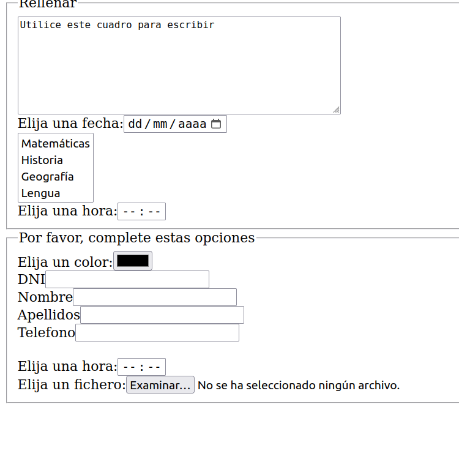

Anexo: ejercicios sobre formularios
=====================================
En los ejercicios siguientes se muestra el diseño básico de algunos formularios junto con el HTML que los resuelve.

Formulario 1
------------------------------------------------------------

Generar el formulario siguiente de acuerdo a los siguientes requisitos

* Hay un control para indicar la hora.
* Contiene los siguientes ``checkboxes``:checkbox con el ``name``  "lenguaje" , ``value``  "lenguajepython"  y el texto "Python", checkbox con el ``name``  "lenguaje" , ``value``  "lenguajehtml"  y el texto "HTML", checkbox con el ``name``  "lenguaje" , ``value``  "lenguajevisual_basic"  y el texto "Visual Basic", checkbox con el ``name``  "lenguaje" , ``value``  "lenguajejava"  y el texto "Java".
* Hay un control para indicar la fecha.
* Contiene los siguientes ``radiobuttons``:radio con el ``name``  "lenguaje" , ``value``  "lenguajepython"  y el texto "Python", radio con el ``name``  "lenguaje" , ``value``  "lenguajehtml"  y el texto "HTML", radio con el ``name``  "lenguaje" , ``value``  "lenguajevisual_basic"  y el texto "Visual Basic", radio con el ``name``  "lenguaje" , ``value``  "lenguajejava"  y el texto "Java".
* Hay los siguientes cuadros de texto:cuadro de texto con el texto "DNI" y el ``name`` dni, cuadro de texto con el texto "Nombre" y el ``name`` nombre, cuadro de texto con el texto "Apellidos" y el ``name`` apellidos, cuadro de texto con el texto "Email" y el ``name`` email
* Hay los siguientes cuadros de texto:cuadro de texto con el texto "Instituto" y el ``name`` instituto, cuadro de texto con el texto "Estudios elegidos" y el ``name`` estudios
* Hay un control para indicar la hora.
* Hay una lista desplegable con el ``name`` "lenguaje" y con las siguientes opciones: opción "Java" con el ``value`` java, opción "Python" con el ``value`` python, opción "HTML" con el ``value`` html, opción "Visual Basic" con el ``value`` visual_basic, opción "CSS" con el ``value`` css.
* Hay un control para indicar la fecha.
* Contiene los siguientes ``radiobuttons``:radio con el ``name``  "asignatura" , ``value``  "asignaturalengua"  y el texto "Lengua", radio con el ``name``  "asignatura" , ``value``  "asignaturamatematicas"  y el texto "Matemáticas", radio con el ``name``  "asignatura" , ``value``  "asignaturahistoria"  y el texto "Historia", radio con el ``name``  "asignatura" , ``value``  "asignaturageografia"  y el texto "Geografía".
* Contiene los siguientes ``checkboxes``:checkbox con el ``name``  "hardware" , ``value``  "hardwaremonitor_led"  y el texto "Monitor LED", checkbox con el ``name``  "hardware" , ``value``  "hardwaressd"  y el texto "SSD".

    
Solución:

.. literalinclude:: formulario_01.html
	:language: html

    
Formulario 2
------------------------------------------------------------

Generar el formulario siguiente de acuerdo a los siguientes requisitos

* Hay una lista desplegable múltiple con el ``name`` "sexo" y con las siguientes opciones: opción "Mujer" con el ``value`` mujer, opción "Hombre" con el ``value`` hombre.
* Hay un ``textarea`` que mide 6 filas y 47 columnas que lleva dentro el texto "Escriba aquí, por favor"
* Hay los siguientes cuadros de texto:cuadro de texto con el texto "Nombre" y el ``name`` nombre, cuadro de texto con el texto "Apellidos" y el ``name`` apellidos, cuadro de texto con el texto "Email" y el ``name`` email, cuadro de texto con el texto "Telefono" y el ``name`` telefono
* Hay los siguientes cuadros de texto:cuadro de texto con el texto "Instituto" y el ``name`` instituto, cuadro de texto con el texto "Estudios elegidos" y el ``name`` estudios, cuadro de texto con el texto "Nombre" y el ``name`` nombre, cuadro de texto con el texto "Apellidos" y el ``name`` apellidos, cuadro de texto con el texto "Email" y el ``name`` email
* Hay una lista desplegable múltiple con el ``name`` "navegador" y con las siguientes opciones: opción "Firefox" con el ``value`` firefox, opción "Chrome" con el ``value`` chrome, opción "Opera" con el ``value`` opera, opción "IE" con el ``value`` ie.
* Hay un control para elegir el color.
* Contiene los siguientes ``radiobuttons``:radio con el ``name``  "navegador" , ``value``  "navegadorfirefox"  y el texto "Firefox", radio con el ``name``  "navegador" , ``value``  "navegadorchrome"  y el texto "Chrome", radio con el ``name``  "navegador" , ``value``  "navegadoropera"  y el texto "Opera", radio con el ``name``  "navegador" , ``value``  "navegadorie"  y el texto "IE".

    
Solución:

.. literalinclude:: formulario_02.html
	:language: html

    
Formulario 3
------------------------------------------------------------

Generar el formulario siguiente de acuerdo a los siguientes requisitos

* Hay los siguientes cuadros de texto:cuadro de texto con el texto "Nombre" y el ``name`` nombre, cuadro de texto con el texto "Apellidos" y el ``name`` apellidos, cuadro de texto con el texto "Email" y el ``name`` email, cuadro de texto con el texto "Telefono" y el ``name`` telefono
* Hay un control para indicar la fecha.
* Contiene los siguientes ``checkboxes``:checkbox con el ``name``  "asignatura" , ``value``  "asignaturalengua"  y el texto "Lengua", checkbox con el ``name``  "asignatura" , ``value``  "asignaturamatematicas"  y el texto "Matemáticas", checkbox con el ``name``  "asignatura" , ``value``  "asignaturahistoria"  y el texto "Historia", checkbox con el ``name``  "asignatura" , ``value``  "asignaturageografia"  y el texto "Geografía".
* Hay un control para elegir el color.
* Hay una lista desplegable con el ``name`` "preferencia" y con las siguientes opciones: opción "Ciencias" con el ``value`` ciencias, opción "Letras" con el ``value`` letras.
* Hay un control para indicar la hora.
* Hay un control para elegir ficheros.
* Contiene los siguientes ``radiobuttons``:radio con el ``name``  "lenguaje" , ``value``  "lenguajejava"  y el texto "Java", radio con el ``name``  "lenguaje" , ``value``  "lenguajepython"  y el texto "Python", radio con el ``name``  "lenguaje" , ``value``  "lenguajehtml"  y el texto "HTML", radio con el ``name``  "lenguaje" , ``value``  "lenguajevisual_basic"  y el texto "Visual Basic".
* Contiene los siguientes ``checkboxes``:checkbox con el ``name``  "sexo" , ``value``  "sexomujer"  y el texto "Mujer", checkbox con el ``name``  "sexo" , ``value``  "sexohombre"  y el texto "Hombre".
* Hay una lista desplegable con el ``name`` "formato" y con las siguientes opciones: opción "JPG" con el ``value`` jpg, opción "PNG" con el ``value`` png.
* Hay un control para elegir el color.
* Contiene los siguientes ``radiobuttons``:radio con el ``name``  "conexion" , ``value``  "conexionwifi"  y el texto "Wifi", radio con el ``name``  "conexion" , ``value``  "conexioncable"  y el texto "Cable", radio con el ``name``  "conexion" , ``value``  "conexionfibra"  y el texto "Fibra".

    
Solución:

.. literalinclude:: formulario_03.html
	:language: html

    

