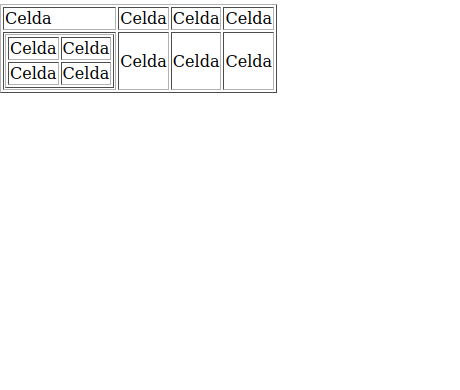
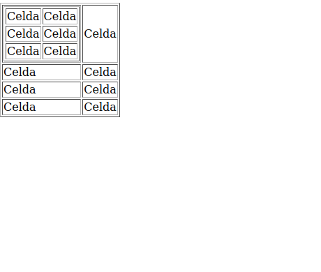
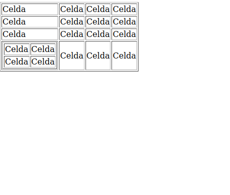
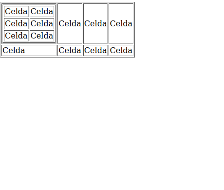
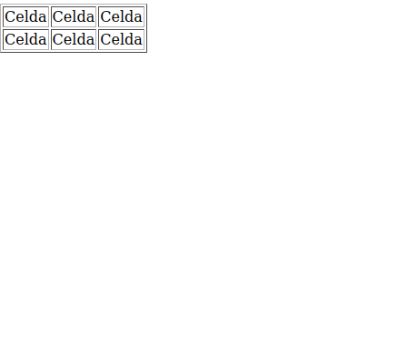
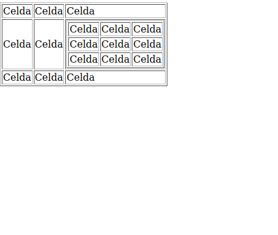

Anexo: ejercicios sobre tablas
=================================

Las tablas HTML muestran cierta complejidad cuando se anidan. En los ejercicios
siguientes se muestran algunas tablas junto con su resolución en HTML. Los
ejercicios no se muestran con ningún orden de dificultad.

Tabla 1
------------------------------------------------------------

Generar la tabla siguiente

    
Solución:

.. literalinclude:: ejercicio_01.html
	:language: html

    
Tabla 2
------------------------------------------------------------

Generar la tabla siguiente

.. image:: foto_02.png
	:align: center
	:scale: 60%

    
Solución:

.. literalinclude:: ejercicio_02.html
	:language: html

    
Tabla 3
------------------------------------------------------------

Generar la tabla siguiente

.. image:: foto_03.png
	:align: center
	:scale: 60%

    
Solución:

.. literalinclude:: ejercicio_03.html
	:language: html

    
Tabla 4
------------------------------------------------------------

Generar la tabla siguiente

.. image:: foto_04.png
	:align: center
	:scale: 60%

    
Solución:

.. literalinclude:: ejercicio_04.html
	:language: html

    
Tabla 5
------------------------------------------------------------

Generar la tabla siguiente

.. image:: foto_05.png
	:align: center
	:scale: 60%

    
Solución:

.. literalinclude:: ejercicio_05.html
	:language: html

    
Tabla 6
------------------------------------------------------------

Generar la tabla siguiente

    
Solución:

.. literalinclude:: ejercicio_06.html
	:language: html

    
Tabla 7
------------------------------------------------------------

Generar la tabla siguiente

.. image:: foto_07.png
	:align: center
	:scale: 60%

    
Solución:

.. literalinclude:: ejercicio_07.html
	:language: html

    
Tabla 8
------------------------------------------------------------

Generar la tabla siguiente

.. image:: foto_08.png
	:align: center
	:scale: 60%

    
Solución:

.. literalinclude:: ejercicio_08.html
	:language: html

    
Tabla 9
------------------------------------------------------------

Generar la tabla siguiente

.. image:: foto_09.png
	:align: center
	:scale: 60%

    
Solución:

.. literalinclude:: ejercicio_09.html
	:language: html

    
Tabla 10
------------------------------------------------------------

Generar la tabla siguiente

.. image:: foto_10.png
	:align: center
	:scale: 60%

    
Solución:

.. literalinclude:: ejercicio_10.html
	:language: html

    
Tabla 11
------------------------------------------------------------

Generar la tabla siguiente

    
Solución:

.. literalinclude:: ejercicio_11.html
	:language: html

    
Tabla 12
------------------------------------------------------------

Generar la tabla siguiente

.. image:: foto_12.png
	:align: center
	:scale: 60%

    
Solución:

.. literalinclude:: ejercicio_12.html
	:language: html

    
Tabla 13
------------------------------------------------------------

Generar la tabla siguiente

.. image:: foto_13.png
	:align: center
	:scale: 60%

    
Solución:

.. literalinclude:: ejercicio_13.html
	:language: html

    
Tabla 14
------------------------------------------------------------

Generar la tabla siguiente

    
Solución:

.. literalinclude:: ejercicio_14.html
	:language: html

    
Tabla 15
------------------------------------------------------------

Generar la tabla siguiente

.. image:: foto_15.png
	:align: center
	:scale: 60%

    
Solución:

.. literalinclude:: ejercicio_15.html
	:language: html

    
Tabla 16
------------------------------------------------------------

Generar la tabla siguiente

.. image:: foto_16.png
	:align: center
	:scale: 60%

    
Solución:

.. literalinclude:: ejercicio_16.html
	:language: html

    
Tabla 17
------------------------------------------------------------

Generar la tabla siguiente

    
Solución:

.. literalinclude:: ejercicio_17.html
	:language: html

    
Tabla 18
------------------------------------------------------------

Generar la tabla siguiente

    
Solución:

.. literalinclude:: ejercicio_18.html
	:language: html

    
Tabla 19
------------------------------------------------------------

Generar la tabla siguiente

    
Solución:

.. literalinclude:: ejercicio_19.html
	:language: html

    
Tabla 20
------------------------------------------------------------

Generar la tabla siguiente

    
Solución:

.. literalinclude:: ejercicio_20.html
	:language: html

    
Tabla 21
------------------------------------------------------------

Generar la tabla siguiente

    
Solución:

.. literalinclude:: ejercicio_21.html
	:language: html

    
Tabla 22
------------------------------------------------------------

Generar la tabla siguiente

    
Solución:

.. literalinclude:: ejercicio_22.html
	:language: html

    
Tabla 23
------------------------------------------------------------

Generar la tabla siguiente

.. image:: foto_23.png
	:align: center
	:scale: 60%

    
Solución:

.. literalinclude:: ejercicio_23.html
	:language: html

    
Tabla 24
------------------------------------------------------------

Generar la tabla siguiente

    
Solución:

.. literalinclude:: ejercicio_24.html
	:language: html

    

