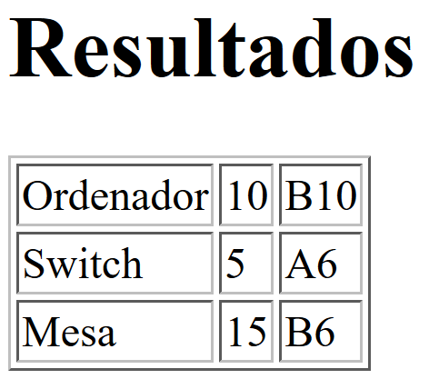

Anexo: ejercicios sobre XSLT
=====================================

Fichero origen
----------------
Para los ejercicios siguiente supondremos que se va a trabajar con el fichero que se muestra a continuación:

.. code-block:: xml
    
    <inventario>
        <producto codigo="P1">
            <peso>10</peso>
            <nombre>Ordenador</nombre>
            <lugar edificio="B">
                <aula>10</aula>
            </lugar>
        </producto>
        <producto codigo="P2">
            <peso>5</peso>
            <nombre>Switch</nombre>
            <lugar edificio="A">
                <aula>6</aula>
            </lugar>
        </producto>
    </inventario>
    
Recuperación de elementos pesados
----------------------------------

Se pide un XSLT que muestre exactamente la misma información del fichero origen pero sin mostrar los elementos cuyo peso sea menor de 7.

Una posible solución sería esta:

.. code-block:: xml
    
    <xsl:stylesheet
     xmlns:xsl="http://www.w3.org/1999/XSL/Transform">
    <xsl:template match="/">
        <inventario>
        <xsl:for-each select="inventario/producto">
            <xsl:if test="peso &lt; 7">
                <producto>
                    <peso>
                        <xsl:value-of select="peso"/>
                    </peso>
                    <nombre>
                        <xsl:value-of select="nombre"/>
                    </nombre>
                    <lugar>
                        <xsl:attribute name="edificio">
                            <xsl:value-of
                                select="lugar/@edificio"/>
                        </xsl:attribute>
                        <aula>
                            <xsl:value-of
                                select="lugar/aula"/>
                        </aula>
                    </lugar>
                </producto>
            </xsl:if>
        </xsl:for-each>
        </inventario>
    </xsl:template>    
    </xsl:stylesheet>
    
Productos del edificio B
----------------------------

Se pide ahora mostrar en el resultado la misma información del fichero origen pero solo en los casos en que el lugar del producto sea el edificio B

La solución es muy parecida, necesitando solamente modificar la condición.

.. code-block:: xml

    
    <xsl:stylesheet
     xmlns:xsl="http://www.w3.org/1999/XSL/Transform">
    <xsl:template match="/">
        <inventario>
        <xsl:for-each select="inventario/producto">
            <xsl:if test="lugar/@edificio='B'">
                <producto>
                    <peso>
                        <xsl:value-of select="peso"/>
                    </peso>
                    <nombre>
                        <xsl:value-of select="nombre"/>
                    </nombre>
                    <lugar>
                        <xsl:attribute name="edificio">
                            <xsl:value-of
                                select="lugar/@edificio"/>
                        </xsl:attribute>
                        <aula>
                            <xsl:value-of
                                select="lugar/aula"/>
                        </aula>
                    </lugar>
                </producto>
            </xsl:if>
        </xsl:for-each>
        </inventario>
    </xsl:template>    
    </xsl:stylesheet>
    
Tabla de localizaciones
--------------------------

Generar una tabla HTML que muestre la información del fichero origen de la manera siguiente:

    
.. code-block:: xml
    
    <xsl:stylesheet
     xmlns:xsl="http://www.w3.org/1999/XSL/Transform">
    <xsl:template match="/">
        <inventario>
        <xsl:for-each select="inventario/producto">
            <xsl:if test="lugar/@edificio='B'">
                <producto>
                    <peso>
                        <xsl:value-of select="peso"/>
                    </peso>
                    <nombre>
                        <xsl:value-of select="nombre"/>
                    </nombre>
                    <lugar>
                        <xsl:attribute name="edificio">
                            <xsl:value-of
                                select="lugar/@edificio"/>
                        </xsl:attribute>
                        <aula>
                            <xsl:value-of
                                select="lugar/aula"/>
                        </aula>
                    </lugar>
                </producto>
            </xsl:if>
        </xsl:for-each>
        </inventario>
    </xsl:template>    
    </xsl:stylesheet>