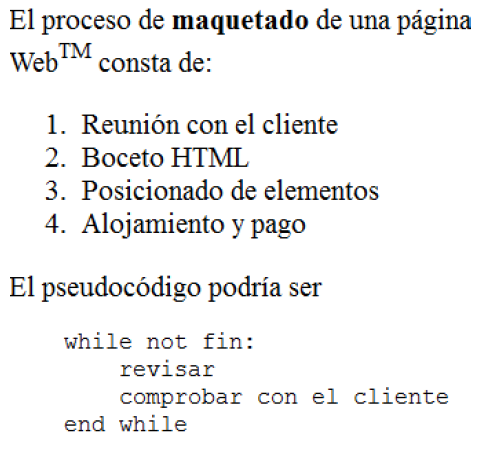
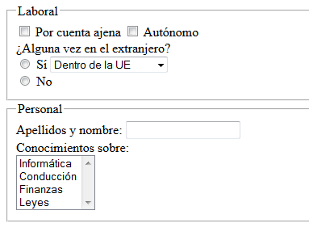

=====
HTML5
=====

Introducción
=============
Es la última revisión del estándar HTML. Se incluyen algunas etiquetas nuevas cuyo significado
se comentará a continuación. Aún está completándose.

Etiquetas estructurales
========================
Crean la estructura para el resto de la página:,

* doctype: identifica el estándar.
* todo documento debe ir entre las marcas <html> y </html>.
* Todo html tiene dos partes: head y body. El primero incluye otros elementos estructurales como ``<title>`` que indica el título de dicha página. Dentro del body se incluye el contenido real de la página.
* Existe una etiqueta vital para el correcto visionado de los símbolos de nuestra página. Esta etiqueta se denomina <meta> y lleva el atributo ``charset="...."``
* Dentro del body pueden incluirse otras etiquetas que estructuran el contenido de la página:

	* La etiqueta ``<section>`` permite marcar contenido de una página relacionado con un tema concreto.
	
	* ``<article>`` es una unidad de contenido sobre un tema específico el cual puede ser independiente de otros "artículos".
	
	* ``<header>`` se utiliza para indicar cual es la cabecera de un artículo o sección.
	
	* ``<footer>`` permite definir un "pie de página", normalmente con indicación de derechos de autor, fecha o datos similares.
	
	* ``<address>`` se usa para marcar información de contacto.
	
	* ``<aside>`` se usa para definir contenido con "una relación vaga con el resto de la página" (definición tomada del estándar).
	
	*  ``<hgroup>`` permite agrupar un conjunto de encabezados y marcarlos como pertenecientes al mismo contenido.

* ``<h1>``, ``<h2>``, ``<h3>``, ``<h4>``, ``<h5>`` y ``<h6>`` establecen encabezados: trozos de texto que identifican la importancia del siguiente trozo de texto.
* Cualquier etiqueta puede ir comentada. Los comentarios no se muestran, son solo de interés para el programador en un futuro. Un comentario se abre con ``<!--`` y se cierra con ``-->``

* La etiqueta ``<nav>`` se utilizará para crear barras de navegación.

* La etiqueta ``<aside>`` se utiliza para indicar información relacionada con el artículo o texto pero que no tiene porque ser parte del mismo. El ejemplo más común es utilizarlo para publicidad relacionada o texto del tipo "artículos relacionados con este".

* La etiqueta ``<base>`` define la URL raíz de toda la página. Permite cambiar fácilmente las URL de los enlaces de una página.

* Las etiquetas ``<script>`` y ``<noscript>`` se utilizan para marcar pequeños programas o la ausencia de ellos.

* El elemento ``<main>`` indica **el contenido principal de una página**

Etiquetas de formato
====================

Para el formateo elemental de textos se utilizan varias etiquetas:

* ``<b>`` Formatea el texto en “negrita”.
* ``<i>`` Lo pone en “itálica” (cursiva).
* ``<u>`` Subraya el texto.
* Las diversas etiquetas se pueden meter unas dentro de otras para obtener efectos como “cursiva, y negrita” o “subrayado y cursiva”, sin embargo las etiquetas deben cerrarse en el orden inverso al que se abrieron.
* ```` y ```` fabrican respectivamente superíndices y subíndices.
* ``<em>`` se utiliza para enfatizar un texto.
* ``
`` Se utiliza para marcar el comienzo y el fin de un párrafo.
* La etiqueta ``br`` se utiliza para hacer una ruptura en el flujo del texto. Se escribe en forma abreviada `` ``

Gestión de espacios
===================

Los navegadores web manejan el espacio de una forma un poco especial:

* Si se pone uno o varios espacios en blanco o si se pulsa la tecla ENTER muchas veces el navegador mostrará *un solo espacio en blanco*
* Para poner un espacio en blanco horizontal se puede usar la entidad ``&nbsp;`.
* Para hacer un salto de línea se puede usar la etiqueta `` `` (esta etiqueta no lleva asociada una etiqueta de cierra, es *autocerrada*)
* Se puede indicar el comienzo y el final de un párrafo con ``
`` y ``
``.

Una pregunta habitual es "¿Cuando se debe usar ``
`` y cuando `` ?``. La respuesta es "depende". Una posible respuesta es que si se escriben varios párrafos relacionados es bastante habitual separarlos con `` `` mientras que si se ponen varios párrafos que hablan de distintas cosas es habitual usar ``
`` con cada uno de ellos, sin embargo no hay una respuesta universal.,

Entidades
=========

Las entidades HTML permiten escribir determinados símbolos especiales que podrían confundir al navegador, así como otros símbolos que no aparecen directamente en los teclados:

* &lt; y &gt; representan los símbolos < y >.
* &copy; 
* &trade; 
* &reg;
* &euro; y &yen;
* &amp;

Texto preformateado
===================
Algunas marcas, como ``<pre>`` permiten obligar al navegador a que respete los espacios en blanco tal y como aparecen en la página original.

Si se desea indicar que algo debe ser teclado por el usuario se usa la marca ``<kbd>``.  

Si se desea indicar que algo es una variable se puede usar la marca ``<var>``.

La etiqueta ``<code>`` permite indicar que un determinado es código en un lenguaje de programación. 

Listas
======

Es una secuencia de elementos relacionados en torno a un mismo concepto Para abrir una lista de elementos se utilizan dos posibles marcas:

* ``<ol>`` Para crear una lista ordenada (numerada)
* ``<ul>`` Para crear una lista desordenada (no numerada)

Una vez creadas hay que etiquetar cada elemento de la lista con la etiqueta <li>

En un plano distinto se pueden encontrar las **listas de definiciones**. Con estos elementos se puede especificar una secuencia de términos para los cuales proporcionamos una definición. Su estructura es la siguiente:

* ``<dl>`` y ``</dl>`` marcan el inicio y el final de la lista de definiciones. Dentro de estas etiquetas pondremos las dos siguientes.

* ``<dt>`` y ``</dt>`` especifican el *término* que vamos a definir.

* ``<dd>`` y ``</dd>`` indican la definición asociada al término anterior.

Ejemplo:

.. code-block:: html

	<dl>
		<dt>Etiqueta</dt>
		<dd>Todo lo contenido...</dd>
		<dt>Elemento</dt>
		<dd>
			Se define así a todo el árbol
			de nodos comprendido
			entre dos etiquetas
			de apertura y cierre.
		</dd>
	</dl>

Ejercicio
----------------

Comprueba que el siguiente código HTML crea unas listas dentro de otras. Prueba a crear listas desordenadas dentro de listas desordenadas.

.. code-block:: html

	<body>
        Antes de programar
        <ol>
            <li>
                Instalar JDK
                <ol>
                    <li>Ir a oracle.com</li>
                    <li>Buscar JDK</li>
                    <li>Aceptar licencia</li>
                    <li>Descargar</li>
                    <li>
                        Ejecutar setup.exe
                        <ol>
                            <li>
                                Ejecutar como
                                admin
                            </li>
                            <li>Comprobar</li>
                        </ol>
                    </li>
                </ol>
            </li>
            <li>Modificar variables de entorno</li>
            <li>Asignar más memoria</li>
            <li>Reiniciar</li>
        </ol>
        Prerrequisitos
        <ul>
            <li>Comprobar RAM</li>
            <li>Comprobar disco</li>
            <li>Comprobar arranque</li>
        </ul> 
    </body>	

Tablas
======

Una tabla muestra un conjunto de elementos relacionados en forma de matriz. No deberían usarse para maquetar la posición de los elementos. Todo el contenido de la tabla debe ir entre las etiquetas ``<table>`` y ``</table>``. Las tablas se construyen de izquierda a derecha (por columnas) y de arriba a abajo (filas).

Una tabla puede tener una cabecera, un cuerpo y un pie, especificados por ``<thead>``, ``<tbody>`` y ``<tfoot>``. La primera etiqueta dentro de ``<tbody>``, solo puede ser <tr>. **Cuidado al crear tablas, todo dato, o subtablas debe ir dentro de <td>, es absolutamente obligatorio**

Para ser exactos una tabla puede llevar estas tres etiquetas:

* ``thead``: dentro de ella a su vez pondremos una fila (``<tr>``) con celdas en las que la etiqueta es ``<th>``
* ``tbody``: utiliza las filas y columnas normales.
* ``tfooter``: también usa ``<tr>`` y ``<td>`` de la forma habitual, sin embargo permite describir mejor el contenido de la tabla. Se utiliza para celdas con los valores acumulados o similares.

Un ejemplo de tabla
---------------------------

Se desea crear una tabla que represente los datos del medallero de unas olimpiadas y que se muestre de forma parecida a lo que muestra la figura:

.. code-block:: html

        <table border="1">
            <thead>
                <tr>
                    <th>País</th>
                    <th>Oro</th>
                    <th>Plata</th>
                    <th>Bronce</th>
                </tr>
            </thead>
            <tbody>
                <tr>
                    <td>USA</td>
                    <td>110</td>
                    <td>115</td>
                    <td>99</td>
                </tr>
            </tbody>
            <tfoot>
                <tr>
                    <td>Total</td>
                    <td>219</td>
                    <td>247</td>
                    <td>206</td>
                </tr>
            </tfoot>
        </table>

	

Ejercicio sobre tablas
----------------------

Crea una tabla con la estructura siguiente:

	
Solución
--------

Un posible HTML que resuelve esto sería:

.. literalinclude:: ejercicio2/ejtabla1.html
	:language: html
	
	
Ejercicio sobre tablas (II)
----------------------------

Crea una tabla con la estructura siguiente:

.. image:: tabla2.png
	:align: center
	:scale: 50%
	
Solución
--------

Un posible HTML que resuelve esto sería:

.. literalinclude:: ejercicio2/ejtabla2.html
	:language: html
	
	
Ejercicio sobre tablas (III)
----------------------------

Crea una tabla con la estructura siguiente:

	
Solución
--------

Un posible HTML que resuelve esto sería:

.. literalinclude:: ejercicio2/ejtabla3.html
	:language: html
	
Ejercicio sobre tablas (IV)
----------------------------

Crea una tabla con la estructura siguiente:

	
Solución
--------

Un posible HTML que resuelve esto sería:

.. literalinclude:: ejercicio2/ejtabla4.html
	:language: html
	

Ejercicio sobre tablas (V)
--------------------------------------------

Crea una tabla con la estructura siguiente

.. figure:: tablaeco1.png
   :figwidth: 50%
   :align: center
   
   

Solución
------------------------------------------------------

.. code-block:: html

	<table border="1">
		<thead>
			<tr>
				<th>País</th>
				<th>Datos econ.</th>
			</tr>
		</thead>
		<tbody>
			<tr>
				<td>España</td>
				<!--Atención
				¡Tabla dentro de celda-->
				<td>
					<table border="1">
						<tr>
							<td>
								PIB:-0,1%
							</td>
						</tr>
						<tr>
							<td>
								Déficit:5%
							</td>
						</tr>
						<tr>
							<td>
								Paro 25,4%
							</td>
						</tr>
					</table>
				</td>
			</tr>
			<tr>
				<td>USA</td>
				<!--Otra tabla dentro de celda-->
				<td>
					<table border="1">
						<tr>
							<td>
								PIB:0,4%
							</td>
						</tr>
						<tr>
							<td>
								Déficit:3%
							</td>
						</tr>
						<tr>
							<td>
								Paro:11%
							</td>
						</tr>
					</table>
				</td>
			</tr>
		</tbody>
	</table>	
	
Ejercicio sobre tablas (VI)
------------------------------------------------------

Crea una tabla con la estructura siguiente

.. figure:: tablaeco2.png
   :figwidth: 50%
   :align: center
   	
	
Solución
------------------------------------------------------

.. code-block:: html

	<table border="1">
		<tbody>
			<tr>
				<td>España</td>
				<td>
					<!--Subtabla-->
					<table border="1">
						<tr>
							<td>
								I+D:7%
							</td>
							<td>
								IRS:13%
							</td>
						</tr>
					</table>
				</td>
			</tr>
			<tr>
				<td>ALCA</td>
				<td>
					<!--Subtabla-->
					<table border="1">
						<tr>
							<td>
								I+D:3%
							</td>
							<td>
								Felic:38
							</td>
							<td>
								Resto:42%
							</td>
						</tr>
					</table>
				</td>
			</tr>
			<tr>
				<td>UE</td>
				<td>
					<!--Subtabla-->
					<table border="1">
						<tr>
							<td>
								España
							</td>
							<td>
								I+D:8%
							</td>
							<td>
								SS:25%
							</td>
						</tr>
						<tr>
							<td>
								Resto UE
							</td>
							<td>
								I+D:13%
							</td>
							<td>
								Otros:28%
							</td>
						</tr>
					</table>
				</td>
			</tr>
		</tbody>
	</table>	

		
	
Formularios
===========

Un formulario permite que el usuario interactúe con la página por medio de una serie de controles

Campo de texto
--------------

Permite crear una zona donde el usuario puede escribir y se muestra un ejemplo a continuación. Tiene algunos atributos que se usan muy a menudo:

* ``type`` indica el tipo de control
* ``name`` será el nombre de la variable en JS (no lo usaremos por ahora)
* ``id`` permitirá procesar el control de JS (no se usará por ahora)
* ``value`` permite indicar un valor por defecto
* ``size`` indica la anchura por defecto

.. code-block:: html

	<input type="text" name="nombre_usuario"
		id="id_nombre" value="Escriba su nombre aqui">

		
Un campo de texto puede llevar asociada una etiqueta ``label`` que indique al navegador que texto va con ese campo. Esto es de utilidad para programas lectores de páginas y en general para gente con discapacidad.

.. code-block:: html

	<label for='"d_nombre">Nombre de usuario</label>
	<input type="text" name="nombre_usuario"
		id="id_nombre" value="Escriba su nombre aqui">

Si el type de este elemento se sustituye por ``password`` se obtiene un control igual, pero que reemplaza el texto por símbolos que ocultan el texto.

Selector único (radio-button)
---------------------------------

Permite elegir una sola opción de entre muchas, se necesita usar un ``input`` de tipo ``radio``.

.. code-block:: html

	 
	<input type="radio" name="sexo">Masculino
	 
	<input type="radio" name="sexo">Femenino
	
Selector múltiple (checkbox)
-----------------------------

Permite elegir múltiples combinaciones de opciones. El nombre del control utilizará los corchetes para crear un vector que se procesará desde Javascript.

.. code-block:: html

	 
	<input type="checkbox" name="medios[]">
	Coche
	 
	<input type="checkbox" name="medios[]">
	Moto
	 
	<input type="checkbox" name="medios[]">
	Bici
	
	
Lista desplegable
-----------------

Permite elegir valores de una lista.

.. code-block:: html

	<select name="provincia">
		<option value="AB">Albacete</option>
		<option value="CR">Ciudad R.</option>
		<option value="CU">Cuenca</option>
	</select>
	
Se debe recordar que el texto que ven los usuarios es lo que va entre las etiquetas option. El valor que comprobarán los programadores es lo que va en value En una lista desplegable se pueden elegir muchos valores usando el atributo ``multiple``.

Textareas
---------

Permiten introducir textos muy largos:

.. code-block:: html

	<textarea rows="10" cols="15">
		Valor por defecto
	</textarea>

Ejercicio
---------

Crear un formulario que pregunte al usuario por su nombre, apellidos, fecha de nacimiento y país. ¿Qué controles habría que usar para cada tarea?

.. literalinclude:: paises.html
	:language: html
	
	
Es importante recalcar que cada vez más, muchas personas visitan páginas desde dispositivos móviles, por eso deberíamos intentar reducir la cantidad de texto que deben teclear. Así, por ejemplo, en lugar de pedir que se teclee la fecha de nacimiento, tal vez puedan seleccionarse opciones de un menú. Para generar la lista de años o de países, probablemente podamos crear un programa que nos genere los ``option`` automáticamente.

Ejercicios tipo examen
======================

Enunciado
---------
*Crea una tabla con la estructura siguiente*

.. image:: tabla5.png
	:align: center
	:scale: 50%
	
	
Solución
--------

El siguiente HTML produce algo muy parecido:

.. code-block:: html

	<table border="1">
		<tr>
			<td>Celda 1</td>
			<td>Celda 2</td>
		</tr>
		<tr>
			<td>
				<table border="1">
					<tr>
						<td>Celda 3a</td>
						<td>Celda 3b</td>
						<td>Celda 3c</td>
					</tr>
				</table>
			</td>
			<td>
				<table border="1">
					<tr>
						<td>Celda 4a</td>
					</tr>
					<tr>
						<td>Celda 4b</td>
					</tr>
					<tr>
						<td>Celda 4c</td>
					</tr>
				</table>
			</td>
		</tr>
	</table>	

	
Enunciado
------------------------------------------------------

*Crea una página HTML que produzca este resultado*

.. figure:: tabla6.png
   :figwidth: 50%
   :align: center
   
   Una tabla compleja
   
Solución
------------------------------------------------------

El HTML siguiente produce el resultado pedido:

.. code-block:: html

	<table border="1">
		<tr><!--Primera fila-->
			<td>
				<table border="1">
					<tr>
						<td>1a</td>
						<td>1b</td>
					</tr>
				</table>
			</td>
			<td>
				<table border="1">
					<tr>
						<td>2a</td>
						<td>2b</td>
					</tr>
					<tr>
						<td>2c</td>
						<td>2c</td>
					</tr>
				</table>
			</td>
		</tr>
		<tr><!--Segunda fila-->
			<td>
				3a
			</td>
			<td>
				<table border="1">
					<tr>
						<td>4a1</td>
						<td>4a2</td>
						<td>4a3</td>
					</tr>
				</table>
			</td>
		</tr>
		<tr> <!--Tercera fila-->
			<td>
				<table border="1">
					<tr>
						<td>3b1</td>
						<td>3b2</td>
					</tr>
					<tr>
						<td>3b3</td>
						<td>3b4</td>
					</tr>
				</table>
			</td>
			<td>
				4b
			</td>
		</tr>
	</table>	
   

Enunciado
---------
*Crea una página HTML que produzca este resultado*

	
Solución
--------

	
	
Enunciado
---------

*Crea un formulario como este donde haya 3 opciones en la lista desplegable: "Más de 400", "Menos de 400", "Variables"*

Solución
--------

El HTML siguiente produce el resultado pedido

Enunciado
---------

*Crea un formulario como este*

.. literalinclude:: ejercicio2/maqueta4.html
	:language: html
	
	
Enunciado
------------------------------------------------------

*Crea un formulario como este*

Solución
------------------------------------------------------

.. code-block:: html

	<form>
		<fieldset>
			<legend>
				Laboral
			</legend>
			<input type="checkbox"
				   name="contratos[]"
				   id="ajena">
			Por cuenta ajena
			<input type="checkbox"
				   name="contratos[]"
				   id="autonomo">
			Autónomo
			 
			¿Alguna vez en el extranjero?
			 
			<input type="radio"
				   name="en_extranjero"
				   id="si_en_extranjero">
			Sí
			
			<select name="lugar">
				<option id="en_ue">
					Dentro de la UE
				</option>
				<option id="en_asia">
					En Asia
				</option>
				<option id="en_hispanoamerica">
					En Hispanoamérica
				</option>
				<option id="en_eeuu">
					En EE.UU
				</option>
				<option id="en_otro">
					En otro
				</option>
			</select>
			 
			<input type="radio"
				   name="en_extranjero"
				   id="no_en_extranjero">
			No
		</fieldset>
		<fieldset>
			<legend>
				Personal
			</legend>
			Apellidos y nombre:
			<input type="text"
				   id="ap_nombre">
			 
			Conocimientos sobre: 
			<select name="cono" multiple>
				<option id="informatica">
					Informática
				</option>
				<option id="conduccion">
					Conducción
				</option>
				<option id="finanzas">
					Finanzas
				</option>
				<option id="leyes">
					Leyes
				</option>
			</select>
		</fieldset>
	</form>

	