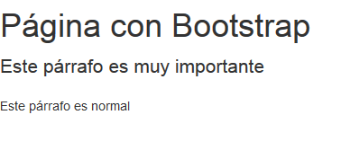

===
CSS
===

Introducción
============

El lenguaje CSS permite cambiar el aspecto de páginas web utilizando enlaces a archivos de hojas de estilo. Si todos los HTML de un portal web cargan el mismo archivo CSS se puede cambiar todo un conjunto de HTML's modificando un solo CSS.

Posicionamiento
===============

Para posicionar los elementos se suelen utilizar dos etiquetas que no hacen nada especial, salvo actuar de contenedores. Las etiquetas  y 
.

*  se usa para no romper el flujo, es decir en principio todo va en la misma línea
* 
 sí rompe el flujo, por lo que va a una línea distinta

En cualquier etiqueta puede ocurrir que deseemos que el estilo no se aplique a todos los elementos o que queramos que se aplique a unos cuantos (pero no a todos). En ese caso, se deben utilizar los atributos ``class`` e ``id``

* El ``class`` es un atributo que puede llevar el mismo valor en muchos elementos HTML y que nos permitirá despues seleccionarlos a todos.
* El ``id`` es un atributo que debe tener distinto valor en todos los casos, no se puede repetir.

Para posicionar correctamente un span o un div, se deben tener en cuenta
varias cosas:

* Todos deberían llevar un id o un class (o las dos cosas)
* El posicionamiento tiene varias posibilidades:
	* ``fixed``: la caja va en cierta posición y no se mueve de allí
	* ``absolute``: la caja va en cierta posición inicial y puede desaparecer al hacer scroll.
	* ``relative``: podemos indicar una posición para indicar el desplazamiento relativo con respecto a la posición que le correspondería según el navegador
	* static: dar permiso al navegador para que coloque la caja donde corresponda 
	* float: mover la caja a cierta posición permitiendo que otras cajas floten a su alrededor
	
Ejercicio propuesto
-----------------------------

Crea una página con la siguiente estructura.

* En la parte superior debe haber dos cajas. Una de ellas, a la izquierda, ocupa el 33% y contiene el lema. La otra, a la derecha, contiene enlaces y ocupa el 66%.

* En la parte central 3 cajas. La de la izquierda contiene publicidad y ocupa el 25%. La central tiene el contenido y ocupa el 50%, la de la derecha tiene más publicidad y ocupa el 25%.

* En la parte de abajo hay una barra **que no se mueve nunca** y que ocupa el 100%. Contiene el mensaje de copyright de la empresa.

Un posible HTML sería el siguiente:

.. literalinclude:: ejemplos/tema3_css/ej1/ejercicio.html
   :language: html
    
Y un posible CSS sería este:

.. literalinclude:: ejemplos/tema3_css/ej1/estilo.css
   :language: css

Ejercicio propuesto (II)
---------------------------

Crear una página con la siguiente estructura:

* En la parte izquierda hay una barra de enlaces. Ocupa el 25% y está **fija**.

* En la zona superior hay una capa con el lema de la empresa. Ocupa el 75% y no se debe ver tapada por los enlaces.

* En la zona central hay dos capas. Una de ellas es el contenido y ocupa aproximadamente el 50%. A su lado hay una capa con publicidad que ocupa el 20%.

* En la zona inferior hay una capa con el copyright de la empresa. Ocupa el 50% y se ve junto al margen derecho de la página.

Un posible HTML sería el siguiente:

.. literalinclude:: ejemplos/tema3_css/ej2/ejercicio.html
   :language: html
    
Y un posible CSS sería este:

.. literalinclude:: ejemplos/tema3_css/ej2/estilo.css
   :language: css

   
Ejercicio de maquetación
------------------------------------------------------

Crear una página con la siguiente estructura:

* En el margen izquierdo debe aparecer una barra de enlaces que ocupe el 20 o 25% de la anchura de la página y no debe desaparecer aunque el usuario se mueva.
* En el margen derecho debe aparecer una caja con el texto y resto de información de interés que debe ocupar el 80 o 75% de la página y el texto se mueve cuando el usuario se mueve.

* Aplicar bordes y efectos visuales a ambas cajas para intentar que el efecto final sea estéticamente aceptable.
	
.. figure:: maquetacion1.png
   :figwidth: 50%
   :align: center
	
   Resultado final

HTML
~~~~~~~~~~~~~~~~~~~~~~~~~~~~~~~~~~~~~~~~~~~~~~~~~~~~~~~~~~~~

.. code-block:: html

	

        <ul>
            <li>
                <a href="http://www.google.es">
                    Google
                </a>
            </li>
            <li>
                <a href="http://www.terra.es">
                    Terra
                </a>
            </li>
            <li>
                <a href="http://www.yahoo.es">
                    Yahoo
                </a>
            </li>
        </ul>
    

    

     
    

		Nunc tempor libero risus, et ultricies ex auctor a. Curabitur efficitur convallis justo consectetur porttitor. Suspendisse potenti. Curabitur ex felis, lacinia non varius ac, ornare eget lacus. Nunc dolor mauris, fermentum nec augue id, imperdiet eleifend tortor. Vestibulum commodo orci ut lorem suscipit, at sodales justo aliquet. Vestibulum sit amet purus eu mauris imperdiet aliquet sed vitae magna. Integer tempus elit purus ...
    
		
	

	

CSS
~~~~~~~~~~~~~~~~~~~~~~~~~~~~~~~~~~~~~~~~~~~~~~~~~~~~~~~~~~~~

.. code-block:: css

	body{
		background-image:
			url("textura.jpg");
		background-attachment: fixed;
	}

	div#enlaces{
		position: fixed;
		top:40%;
		left:0px;
		width:17%;
	}

	div#contenido{
		width: 80%;
		position: absolute;
		top:0px;
		right: 0px;
	}

	/* Todos los párrafos llevan
	 * un pequeño sangrado extra
	 * de 15 px en la primera línea*/
	p{
		text-indent: 15px;
	}

	img{
		width: 25%;
		border: solid black 1px;
		padding: 4px;
		display: block;
		margin-left: auto;
		margin-right: auto;
	}	
	
Ejercicio 2 de maquetación
------------------------------------------------------

Conseguir una página como esta

.. figure:: maquetaacme.png
   :figwidth: 50%
   :align: center

HTML
------------------------------------------------------

.. code-block:: html

	

		

			
				ACME
			
			
				donde hay que comprar
			
		
 <!--Fin de la cabecera-->
		

			En un lugar de la Mancha ...
		

		

			<ol>
				<li>
					<a href="google.es">
						Google
					</a>
				</li>
				<li>
					<a href="google.es">
						Google
					</a>
				</li>
				<li>
					<a href="google.es">
						Google
					</a>
				</li>
				<li>
					<a href="google.es">
						Google
					</a>
				</li>
			</ol>
		

	

CSS
------------------------------------------------------

.. code-block:: css

	#cabecera{
		text-align: center;
		background-color:
			rgb(242,227,148)
	}
	#marcacabecera{
		font-size: larger;
		font-family: "Impact";
	}
	#lemacabecera{
		font-style: italic;
		font-size: smaller;
		font-family: "Lucida Handwriting";
	}

	div#cuerpo, div#enlaces{
		background-color:
			rgb(217,195,89);
		
	}

	div#cuerpo{
		width:65%;
		float:left;
		margin-top: 20px;
		padding:10px;
		text-align: justify;
		
	}
	div#enlaces{
		width: 20%;
		float:right;
		margin-top:20px;
	}

	div{
		border-width: 1px;
		border-style: solid;
		border-color: black;
		background-color:
			rgb(230,230, 230);
	}

	div#contenedorglobal{
		background-color:
			rgb(188,182,175);
	}

   
   
Ejercicio: barra de herramientas
--------------------------------

Crear una página con dos cajas diferenciadas. Una de ellas, que ocupará el 30% de la página contendrá enlaces a diferentes sitios web. La caja no se moverá aunque el usuario haga scroll. Por  otro lado, la otra caja ocupará el 70% de la página y habrá que llenarla de texto para poder desplazarse por él y comprobar que la caja de enlaces no se mueve.

El HTML sería algo así:

.. code-block:: html

	<!DOCTYPE html>
	<html>
	<head>
		<link rel="stylesheet" href="solucion1.css" type="text/css"/>
		<title>Ejercicio 1</title>
	</head>
	<body>
	

		<ul>
			<li>
				<a href="http://cocacola.com">CocaCola</a>
			</li>
			<li>
				<a href="http://google.com">Google</a>
			</li>
			<li>
				<a href="http://terra.es">Terra</a>
			</li>
			
		</ul>
	

	

		En un lugar de la Mancha..
		En ...
	

	</body>
	</html>

	
Y el CSS que resuelve el problema sería:

.. literalinclude:: css/solucion1.css
	:language: css
	
Ejercicio: ampliación
---------------------
Ampliar el ejemplo anterior para hacer que el contenido solo ocupe el 50% y añadir una barra de publicidad fija en el centro vertical que ocupe el 20%.

El HTML sería

.. code-block:: html

	<!DOCTYPE html>
	<html>
	<head>
		<link rel="stylesheet" href="solucion2.css" type="text/css"/>
		<title>Ejercicio 1</title>
	</head>
	<body>
	

		<ul>
			<li>
				<a href="http://cocacola.com">CocaCola</a>
			</li>
			<li>
				<a href="http://google.com">Google</a>
			</li>
			<li>
				<a href="http://terra.es">Terra</a>
			</li>
			
		</ul>
	

	

		<ul>
			<li>
				<a href="http://iesmaestredecalatrava.es">IES</a>
			</li>
		</ul>
	

	

		En un lugar de la Mancha.. (repetido)
	

	</body>
	</html>

Y el CSS que resuelve el problema sería:

.. literalinclude:: css/solucion2.css
	:language: css
	
Ejercicio
---------

Crear una estructura de página con una cabecera que ocupe el 100% de la página, con texto centrado y algunos enlaces. A continuación un bloque de contenido que ocupe el 70% y a su izquierda un bloque de publicidad que ocupe el 30%. Debe haber un pie de página con el copyright que ocupe el 100% de la página, con el texto centrado y que no se mueva cuando el usuario desplace el texto.

El HTML sería

.. code-block:: html

	<!DOCTYPE html>

	<html>
	<head>
		<link href="solucion4.css" rel="stylesheet" type="text/css">
		<title>Ejercicio</title>
	</head>

	<body>

	<header id="cabecera">
		<a href="http://google.es">Google</a>
		<a href="http://terra.es">Terra</a>
	</header>
	<section id="contenido">
		Texto texto texto ...
		
	</section>
	<aside id="publi">
		<a href="http://cocacola.es">Beba Coca-Cola</a>
	</aside>
	<footer>
		&copy; Pepe Perez, IES Maestre 2013-2014
	</footer>
	</body>
	</html>

Y el CSS que resuelve el problema sería:

.. literalinclude:: css/solucion3.css
	:language: css

	
Posicionamiento float
---------------------
En el posicionamiento ``float`` solo indicaremos la anchura de una caja. El resto de los elementos se encajará automáticamente en el espacio restante dejado por dicha caja.

Ejercicio
---------

Crear una página con una cabecera que ocupe el 100%, que tenga el texto centrado y una zona debajo que tenga 3 partes: contenido (60%), enlaces_relacionados (20%) y publicidad(20% restante). Crear un pie de página con una anchura del 100%.

Gestión de espacios
===================

En CSS se puede controlar el espacio interno y externo por medio de las propiedades ``padding-`` y ``margin-`` pudiendo usar ``margin-top`` o ``padding-left``. Las cuatro posiciones son ``top``, ``bottom``, ``left`` y ``right``

Colores
=======

Los colores en CSS se pueden especificar de varias maneras:

* Por nombre: ``red``, ``yellow``, ``green``
* Mediante ``rgb(rojo, verde, azul``, donde entre comas se pone la cantidad de cada color de 0 a 255. Así, ``rgb(0,0,0)`` es negro y ``rgb(255,255,255)`` es blanco.
* Se puede usar directamente la nomenclatura hexadecimal #ffffff. Donde cada dos letras se indica un número hexadecimal de 00 a ff, que indica respectivamente la cantidad de color rojo, verde o azul.
* Desde hace poco se pueden indicar también con ``hsl(num, num, num)''

Se pueden encontrar en Internet listas de colores denominados "seguros" (buscando por "web safe colors") que indican nombres de color que se ven igual en los distintos navegadores.

Tipografías
===========
En tipografía se habla de dos términos distintos: el "typeface" y la "font".

* Hay tipos "Serif", que llevan "rabito".
* Hay tipos "Sans-serif" que no lo llevan
* Hay tipos monoespaciados

Lo más relevante, es que cuando usamos ``font-family: "Arial";``, el navegador puede decidir poner otro tipo de letra de la misma familia.

Se pueden indicar varios tipos de letra por orden de preferencia.

Google Fonts permite el "embebido" de fuentes de manera muy segura.

Alineación del texto
===========	=========

Se puede usar la propiedad ``text-align: left`` para modificar la alineación del texto, usando ``left``, ``center``, ``right`` o ``justify``

Decoración del texto
====================
Se pueden usar otras propiedades para cambiar
el aspecto del texto como estas:

* ``text-decoration: underline``
* ``text-decoration: overline``
* ``text-decoration: line-through``

Medidas
=======

Normalmente, lo más seguro es usar medidas en forma de porcentajes, pero hay otras

* ``margin: 1cm``
* ``margin: 1in``: esta y la anterior son más útiles cuando creamos hojas de estilo enfocadas a que la página quede bien cuando se imprima.
* ``margin: 1px``: muy dependiente de la resolución
* ``margin: 1%``: es la más apropiada al modificar elementos div en pantalla.
* ``margin: 1em``: equivale aproximadamente a la anchura de una letra "m".

	
Selectores
==========

Explica qué hacen los siguientes selectores y crea un ejemplo HTML donde se pueda ver que realmente funcionan como esperas

* p#destacado
* p.destacado
* p.destacado, span#id1
* p.destacado > li.elemento_enumeracion
* p.destacado > .elemento_numeracion
* .destacado > #id1

Supongamos que tenemos un archivo HTML como este:

.. code-block:: html

	

		Párrafo sin class ni ide
	

	

		Párrafo con el class 'cita' 
		y el id 'p_destacado'
	

	
Párrafo con el class
		destacado que no 
		contiene nada
	

	

		Párrafo con el class destacado.
		
			Este texto va dentro de 
			un span con el 
			id id1
		
	

	

		<ol>
			<li class="elemento_numeracion">
				Esto es un li
			</li>
			<li class="elemento_numeracion">
				Esto es otro li
			</li>
		</ol>
	

	

		Este párrafo tiene el class 
		destacado y en él enumeramos 
		cosas como
		
			A
		,
		
			B
		 o también
		
			C
		
	

	

		Aquí hay un 
		
			span con el id id1
		
	

	
Solución ``p#destacado``
------------------------------------------------------

Si tenemos un estilo como este:

.. code-block:: css

	p#destacado{
		border:solid black 1px;
	}
	
Lo que ocurrirá es que se pondrá un borde solo al párrafo cuyo ``id`` sea ``destacado``

.. figure:: selectores1.png
   :figwidth: 50%
   :align: center
   
   Resultado
   
Solución ``p.destacado``
------------------------------------------------------

   
Los cambios se aplican a todos los párrafos con el ``class`` *destacado*

.. figure:: selectores2.png
   :figwidth: 50%
   :align: center
   
   Resultado
   
Solución ``p.destacado, span#id1``
------------------------------------------------------

   
Los cambios se aplican a todos los párrafos con el ``class`` *destacado* y también al ``span`` cuyo ``id`` sea ``id1``

.. WARNING::
   Obsérvese que en el HTML hay **dos elementos con el mismo ID**. No se debe hacer esto, ya que corremos el riesgo de que todo se vea mal.

.. figure:: selectores3.png
   :figwidth: 50%
   :align: center
   
   Resultado
   
   

Solución ``p.destacado > li.elemento_enumeracion``
------------------------------------------------------

Los cambios solo se aplican a **los li cuyo class sea elemento_numeración y que además sean hijos de un p cuyo class sea destacado**

¿Por qué los cambios no afectan a ninguno?

Solución ``p.destacado > .elemento_numeracion``
------------------------------------------------------

Ahora sí veremos que algo cambia, en concreto los ultimos ```` que llevan el ``class=elemento_numeracion``, ya que *sí son hijos directos* de un elemento que lleva un ``class=destacado``.

Solución ``.destacado > #id1``
------------------------------------------------------

Ahora el resultado es este

.. figure:: selectores4.png
   :figwidth: 50%
   :align: center
   
   Resultado
   
¿Por qué ahora sí funciona?   
   

Bootstrap
=========

Bootstrap define una estructura básica de clases CSS para facilitar el desarrollo web. En concreto CSS consigue que crear páginas que se vean igual en dispositivos muy distintos sea algo relativamente sencillo.

Estructura básica
------------------------------------------------------

El siguiente HTML define lo mínimo que se necesita para crear una página con Bootstrap. Dentro de ``<body>`` podremos poner lo que necesitemos y el *framework* colocará todo automáticamente y le aplicará cierto estilismo.

.. code-block:: html
	
	<!DOCTYPE html>
	<html lang="en">
	  <head>
		<meta charset="utf-8">
		<meta http-equiv="X-UA-Compatible" content="IE=edge">
		<meta name="viewport" content="width=device-width, initial-scale=1">
		<title>Plantilla bootstrap</title>

		<link href="css/bootstrap.min.css" rel="stylesheet">

		<!--[if lt IE 9]>
		  
		  
		<![endif]-->
	  </head>
	  <body>
		<h1>Página con Bootstrap</h1>
			

			

		

		
	  </body>
	</html>
	

Lo único que se debe asumir es que debe existir un ``
`` cuyo ``class`` sea ``container``

Rejilla o *grid*
------------------------------------------------------

Bootstrap asume que cualquier pantalla tiene una anchura básica de 12 columnas. Podremos crear una fila de elementos y hacer que cada una de ellas ocupe cierta proporción de esas columnas.

Por ejemplo, si deseamos que una fila de contenidos tenga una columna que ocupe la mitad de esas 12 columnas (6) y dos columnas que ocupen la mitad restante, podremos hacer lo siguiente.

.. code-block:: html

	

        

            

                Mitad del contenedor
            

            

                Esto ocupa un cuarto
            

            

                Esto ocupa otro  cuarto
            

        

    

	

.. figure:: bs1.png
   :figwidth: 50%
   :align: center
   
   Ejemplo del grid
   
En realidad Bootstrap define muchos tipos de columna dependiendo del tipo de dispositivo al que nos hayamos enfocado más:

* col-xs-3: ocupa 3 de las doce columnas de un dispositivo que se ha dividido en 12 pero tiene una anchura "muy pequeña/extrasmall" (menos de 768)
* col-sm-3: ocupa 3 de las doce columnas de un dispositivo que se ha dividido en 12 pero tiene una anchura "pequeña/small" (más de 768 y menos de 992)
* col-md-6: ocupa 6 de las doce columnas de un dispositivo que se ha dividido en 12 pero tiene una anchura "media" (unos 992 px)
* col-lg-9: ocupa 9 de las doce columnas de un dispositivo que se ha dividido en 12 pero tiene una anchura "grande/large" (unos 992 px)

Tipografía
------------------------------------------------------

Bootstrap modifica la tipografía por defecto e incluso permite destacar algunos elementos. Por ejemplo un párrafo con la clase ``lead`` destacará:

.. code-block:: html

	

		Este párrafo es muy importante
	

    
Este párrafo es normal

	
	

   
   Párrafo destacado
   
Se puede destacar texto usando lo siguiente:

.. code-block:: html

	<mark>Texto subrayado en amarillo</mark>