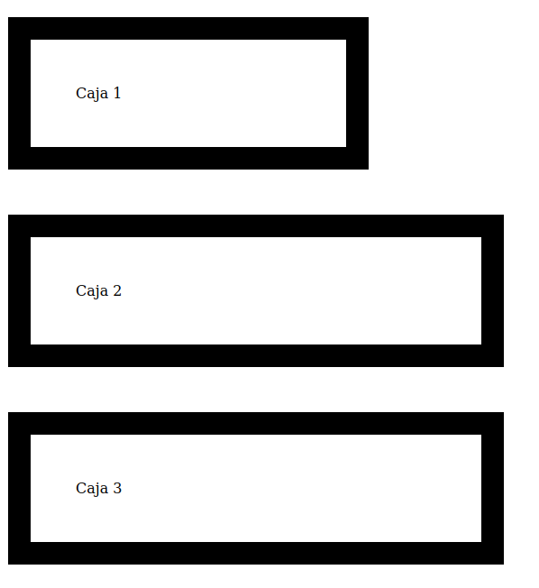

===
CSS
===

Introducción
============

El lenguaje CSS permite cambiar el aspecto de páginas web utilizando enlaces a archivos de hojas de estilo. Si todos los HTML de un portal web cargan el mismo archivo CSS se puede cambiar todo un conjunto de HTML's modificando un solo CSS. A menudo se dice que un CSS es una "hoja de estilo".

Hay tres mecanismos básicos para añadir CSS a un HTML

1. Usar CSS en las etiquetas HTML del cuerpo de la página.
2. Usar CSS en la cabecera del HTML.
3. Usar CSS cargando un archivo externo.


En el  primer caso se haría de esta manera:

.. code-block:: html

    <p style="background-color:red">
    Este párrafo lleva fondo rojo
    </p>

En el segundo caso haríamos algo como esto.

.. code-block:: html

    <html>
        <head>
            <style type="text/css">
            p{
                background-color: red;
            }
            </style>
        </head>
        <body>
            <p>Todos los párrafos van en rojo</p>
        </body>
    </html>


En el tercero haríamos esto:

.. code-block:: html

    <html>
        <head>
            <link type="text/css" href="estilo.css" rel="stylesheet">
        </head>
        <body>
            <p>Todos los párrafos van en rojo</p>
        </body>
    </html>


Debe recordarse lo siguiente:

* Escribir CSS para cada etiqueta es **MUY POCO PRÁCTICO** y difícil de cambiar en el futuro.
* Si hay definiciones contradictorias prevalece siempre el CSS de la etiqueta, despues el del estilo de la cabecera y despues el del archivo externo.
* Lo habitual es definirlo todo en estilos externos.

Recordatorio: el modelo DOM
================================================================================

Se debe recordar que 

* Un elemento es todo lo contenido entre una etiqueta de apertura y una de cierre.
* Un documento HTML (y uno XML, se hablará de ello en el futuro) se representa en forma de árbol.
* Se dice que los nodos del árbol tienen "relaciones de parentesco" y por tanto diremos que "un nodo es hermano de otro" o que "un nodo es padre o hijo de otro nodo".

Sintaxis
===========

CSS funciona mediante reglas, de las cuales se muestra un ejemplo a continuación.

.. code-block:: css

    h1, h3 {
        background-color: blue;
        color: white;
    }

En las reglas tenemos tres cosas:

1. Los selectores. En este caso queremos modificar como van a quedar todos los ``<h1>`` y ``<h3>``
2. Las propiedades. En el ejemplo se pretende cambiar el color de fondo y el color de las letras.
3. Los valores. En este caso se pone el valor ``blue`` para la propiedad ``background-color`` y el valor ``white`` para la propiedad ``color``


En el siguiente CSS se muestran los principales selectores.

.. code-block:: css

    h1{ /*Selecciona TODOS los h1 y les pone fondo azul*/
        background-color: blue;
    }
    h1, h2{ /*Selecciona TODOS LOS H1 Y TODOS LOS H2 y les pone fondo azul*/
        background-color: blue;
    }
    h1.titular{ /*Selecciona TODOS LOS H1 con el class "titular"*/
        background-color: blue;
    }
    h1#titulonoticia{ /*Selecciona SOLO UN H1, el que tenga el id indicado*/
        background-color: blue;
    }

    /* Selecciona todos los elementos li que sean hijos de un ul*/
    ul>li {
        background-color: blue;
    }

    /* Selecciona los párrafos que vayan justo detrás de un div*/
    div + p{
        background-color: blue;
    }
    
    /* Selecciona todos los elementos li que estén dentro de algun ul,
    INCLUSO AUNQUE NO SEAN HIJOS DIRECTOS, sino "nietos", "bisnietos"...*/
    ul li {
        background-color: blue;
    }


    /* Esto es una "pseudo-clase" selecciona los enlaces no visitados
    y los pone con fondo azul*/
    a:link{ 
        background-color: blue;
    }

    /* Pone en fondo rojo los enlaces ya visitados*/
    a:visited{
        background-color: blue;
    }

Un fichero para hacer pruebas con selectores
--------------------------------------------------------------------------------

.. code-block:: html

    <!DOCTYPE html>
    <html>
        <head>
            <meta charset="utf-8">
        </head>
        <body>
            <div class="noticia1">
                <p class="introduccion">
                    Soy la introducción de la noticia
                </p>
                <p>Párrafo 2 de la noticia 2</p>
                <p id="nucleonoticia1">Párrafo 3 de la noticia 2</p>
                <p>Párrafo 4 de la noticia 2</p>
                <p>
                    Párrafo 5 de la noticia 2. Aquí desgloso
                    algunos elementos importantes.
                    <ul class="listaimportantes">
                        <li>Elemento 1</li>
                        <li>Elemento 2</li>
                        <li>Elemento 3</li>
                    </ul>
                    Además ocurre que

                    <ol>
                        <li>Razón 1</li>
                        <li>Razón 2</li>
                        <li>Razón 3</li>
                    </ol>
                </p>
            </div><!--Fin de la noticia 2-->
            <div class="noticia2">
                    <p class="introduccion">
                        Soy la introducción de la noticia 2
                    </p>
                    <p>Párrafo 2 de la noticia 2</p>
                    <p id="nucleonoticia2">Párrafo 3 de la noticia 2</p>
                    <p>Párrafo 4 de la noticia 2</p>
                    <p>
                        Párrafo 5 de la noticia 2. Aquí desgloso
                        algunos elementos importantes.
                        <ol class="listaimportantes">
                            <li>Elemento 1</li>
                            <li>Elemento 2</li>
                            <li>Elemento 3</li>
                        </ol>
                        Además ocurre que
        
                        <ol>
                            <li>Razón 1</li>
                            <li>Razón 2</li>
                            <li>Razón 3</li>
                        </ol>
                    </p>
                </div><!--Fin de la noticia 2-->
        </body>
    </html>


Los atributos ``class`` e ``id``
=====================================

A menudo tendremos que hacer ambios en un grupo de elementos, pero a veces no serán todos los elementos de una misma clase. Por ejemplo, puede que queramos cambiar un elemento en concreto. Para poder hacer cambios *a un solo elemento* tendremos que haber puesto el atributo ``id`` como muestra el ejemplo siguiente:

.. code-block:: html

    <h1>Encabezamiento</h1>
    .... texto ...
    
    <h1 id="noticia_del_dia">Otro encabezamiento</h1>
    .... texto ...
    
    <h1>Y otro más</h1>
    .... texto ...
    
Si luego desde CSS queremos modificar solo el encabezamiento con la noticia del dia deberemos hacer esto

.. code-block:: css

    h1#noticia_del_dia{
        font-weight: bold;
    }
    
Obsérvese que hemos usado la almohadillas (#) para decir "queremos seleccionar el h1 cuyo id es noticia_del_dia" y ponerlo en negrita. Debe señalarse que es importante que en el HTML **NO DEBE HABER DOS ELEMENTOS CON EL MISMO ID**

Si en vez de uno queremos aplicar un cambio a **un conjunto de elementos** deberemos ir al HTML y ponerles a todos
ellos un atributo ``class`` con el mismo valor en todos ellos. Por ejemplo:


.. code-block:: html

    <h1 class="titular_economia">Encabezamiento</h1>
    .... texto ...
    
    <h1>Otro encabezamiento</h1>
    .... texto ...
    
    <h1 class="titular_economia">Y otro más</h1>
    .... texto ...
    
Con este HTML podemos crear un CSS como este que cambia solo los ``h1`` cuyo ``class`` tiene el valor ``titular_economia``

.. code-block:: css

    h1.titular_economia{
        font-weight: bold;
    }
    
Se puede poner el mismo ``class`` a distintos elementos, por ejemplo así

.. code-block:: html

    <h1 class="titular_economia">Encabezamiento</h1>
    .... texto ...
    
    <h1>Otro encabezamiento</h1>
    .... texto ...
    
    <h2 class="titular_economia">Y otro más</h2>
    .... texto ...

Y luego usar un CSS como este:

.. code-block:: css

    h1.titular_economia, h2.titular_economia{
        font-weight: bold;
    }

Este último CSS **se puede resumir**

.. code-block:: css

    .titular_economia{
        font-weight: bold;
    }

Esta regla dice "seleccionar todos los elementos cuyo class sea titular_economia"  y ponerlos en negrita. Estos mecanismos de resumen son muy útiles y facilitan mucho la tarea del diseñador CSS.


Pseudo-clases
================================================================================

Como ya se ha indicado selecciona elementos en algún estado especial. Hay muchas pero algunas de las principales son:

* ``p:hover`` : selector que se aplica cuando se pasa el ratón por encima del párrafo.
* ``p:first-of-type`` : selector que se aplica al primero de los párrafos.
* ``p:first-child`` : selector que se aplica un párrafo si es el primero de los hijos.
* ``p:last-child`` : selector que se aplica al último párrafo ignorando al resto de hermanos.
* ``p:nth-child(4)`` : selector que se aplica sobre el cuarto párrafo.
* ``p:nth-child(even)`` : selector que se aplica a párrafos impares.
* ``p:nth-child(odd)`` : selector que se aplica a párrafos pares.
* ``a:active`` : selector para enlaces que están siendo pulsados.
* ``a:visited`` : selector para enlaces ya visitados.
* ``a:active`` : selector para enlaces que están siendo pulsados.
* ``input:checked`` : selector para controles (radios, checkboxes) que estén marcados.


Fondos e imágenes
================================================================================

Las principales propiedades son:

* La propiedad ``background-image`` permite cargar una imagen de fondo: P. ej: ``background-image: url("../img/low-res/cork-board.png");``
* La propiedad ``background-repeat`` permite controlar como se repite la imagen, puede tomar los valores ``no-repeat`` , ``repeat-x`` y ``repeat-y`` .
* La propiedad ``background-position`` controla donde se posicionará la imagen, puede tomar varios valores como ``top`` , ``bottom`` , ``left``, ``right`` y ``center``, así como combinaciones. Por ejemplo ``top center`` o ``bottom right`` .
* La propiedad ``background-size`` permite controlar el ancho y el alto. Se hablará más sobre las medidas en otro apartado de los apuntes.
* La propiedad ``background-attachment`` puede ponerse a ``fixed`` para controlar como hace "scroll" la imagen.


Bordes
================================================================================

Se pueden configurar los bordes de cualquier elementos usando algunas propiedades básicas:

* ``border-style``: permite cambiar distintos estilos de borde como ``solid``, ``double``, ``dashed``, ``dotted``, ``inset``, ``outset``. Por ejemplo podemos cambiar un borde con ``border-style: double;`` 
* ``border-color`` permite cambiar el color del borde. Se pueden usar colores usando cualquier mecanismo CSS (nombre de color, valor ``rgb``, color en hexadecimal, etc...).
* ``border-width`` permite cambiar la anchura del borde.

Los bordes pueden cambiarse individualmente y, por ejemplo, añadir un borde solo a la parte de abajo con estas variantes:

* ``border-bottom-style``
* ``border-bottom-color``
* ``border-bottom-width``

Pudiendo reemplazar ``bottom`` con otras posiciones como ``top``, ``left`` o ``right``.

Aparte de eso se puede usar la propiedad ``border-radius: 2px`` para aplicar un redondeo en las esquinas de los bordes.


Texto
================================================================================

Podemos modificar el alineamiento usando la propiedad ``text-align`` . Esta propiedad puede tomar distintos valores en función de la posición que queramos que adopten los márgenes del texto.

* ``text-align: left;`` 
* ``text-align: right;`` 
* ``text-align: center;`` 
* ``text-align: justify;`` 

Se pueden cambiar los tipos de letra usando ``font-family`` , pero ¡cuidado!, es posible que no todos los usuarios tengan los mismos tipos de letra que tenemos en nuestro equipo. Existen servicios como "Google Fonts" que ofrece fuentes de libre distribución de una manera muy cómoda (solo hay que añadir una etiqueta <link> en todos los HTML y una propiedad ``font-family`` a nuestro CSS).

Los textos pueden llevar diversas decoraciones especificadas con la propiedad ``text-decoration``. Por ejemplo :

* ``text-decoration: underline;`` para subrayar.
* ``text-decoration: line-through;`` para tachar.
* ``text-decoration: none;`` que elimina cualquier decoración (es útil para quitar el subrayado de los enlaces.

Se puede modificar el espacio entre letras usando ``letter-spacing:2px`` (usar con cuidado), modificar el espacio entre palabras con ``word-spacing``  o modificar el espacio entre líneas con ``line-height`` .

Se pueden añadir sombras a los textos usando ``text-shadow``. Esta propiedad implica indicar siempre tres cosas : desplazamiento de la sombra en horizonta, desplazamiento en vertical y color. Así, por ejemplo si usamos ``text-shadow:2px 3px blue`` apreciaremos una sombra azul en un texto.

Es posible convertir las mayúsculas o minúsculas de un texto con CSS como ``text-transform: uppercase`` , ``text-transform: lowercase`` o ``text-transform: capitalize`` (esto último muy usado en el mundo anglosajón).

Border externos (Outlines)
================================================================================

Son distintos e independientes de los bordes. Se utilizan para destacar aún más un elementos.   Son complejos de usar porque **no pertenecen al elemento y no forman parte de sus medidas, así que es fácil hacer que se solapen con otro elemento sin querer.** 

Funcionan de manera parecida a los bordes. Todo "outline" tiene un estilo, un grosor y un color que se especifican con:

* ``outline-style`` que puede ser ``solid`` , ``dotted`` , etc...
* ``outline-width`` que puede ir en medidas o en valores como ``thin`` , ``medium`` o ``thick`` 
* ``outline-color`` 
* Existe una última propiedad que permite añadir un espacio extra entre nuestro ``outline`` y nuestro ``border`` . Esta propiedad se llama ``outline-offset`` 


Tablas
================================================================================

Se pueden modificar muchas propiedades de las tablas:

* Se pueden poner bordes a elementos ``table`` y ``td`` con cosas como ``border: solid 1px black``.
* Por definición, cada elemento tiene su propio borde. Si queremos que se unan usaremos ``border-collapse: collapse``
* Se pueden cambiar propiedades filas pares o impares con ``tr:nth-child(even)`` o ``tr:nth-child(odd)`` 
* Se puede cambiar un elemento *solo cuando el ratón pase por encima de él con* cosas como ``tr:hover{background-color:red;}`` 

El modelo de cajas
=====================

En CSS **todo es una caja** y el navegador va colocando las distintas "cajas" en la página web. Las cajas tienen:

* Un margen asociado que las separa de otras cajas.
* Un borde.
* Un espacio interno llamado "padding"
* Un contenido

.. figure:: img/tema3css/modelo-cajas.png
   :alt: El modelo de cajas CSS (imagen tomada de la web del W3C)
   
   El modelo de cajas CSS (imagen tomada de la web del W3C)


* Algunos elementos **no generan una línea nueva** sino que se mantienen dentro de la misma línea. Como por ejemplo ``<b>``, ``<span>`` o ````. A estos elementos se les llama *elementos inline* y no se les puede cambiar la altura o la anchura. Si intentamos cambiar altura o anchura el navegador ignorará el cambio.
* Otros elementos  **generan su propia línea antes y despues.** Esta línea puede ser más alta o menos pero forma su propio bloque o línea. Ejemplo de estas etiquetas son ``<div>`` , ``<p>`` o ``<ul>.``

Podemos conseguir que un inline se porte como un block o viceverse usando el CSS siguiente:

* Bloque: ``display: block;`` 
* Inline: ``display: inline;``
* Existe tambien un ``display:inline-block.`` Estos elementos se portan como inlines y no generan línea nueva pero *sí pueden cambiar de anchura o altura.* 

En el siguiente HTML tenemos un ejemplo de como se comportan estas propiedades:

.. literalinclude:: ejemplos/tema_3_css/inlines/index.html


Posicionamiento
===============

Para posicionar los elementos se suelen utilizar dos etiquetas que no hacen nada especial, salvo actuar de contenedores. Las etiquetas <span> y <div>.

* <span> se usa para no romper el flujo, es decir en principio todo va en la misma línea
* <div> sí rompe el flujo, por lo que va a una línea distinta

En cualquier etiqueta puede ocurrir que deseemos que el estilo no se aplique a todos los elementos o que queramos que se aplique a unos cuantos (pero no a todos). En ese caso, recordemos que se deben utilizar los atributos ``class`` e ``id``

* El ``class`` es un atributo que puede llevar el mismo valor en muchos elementos HTML y que nos permitirá despues seleccionarlos a todos.
* El ``id`` es un atributo que debe tener distinto valor en todos los casos, no se puede repetir.

Para posicionar correctamente un span o un div, se deben tener en cuenta
varias cosas:

* Todos deberían llevar un id o un class (o las dos cosas)
* El posicionamiento tiene varias posibilidades:
	* ``fixed``: la caja va en cierta posición y no se mueve de allí
	* ``absolute``: la caja va en cierta posición inicial y puede desaparecer al hacer scroll.
	* ``relative``: podemos indicar una posición para indicar el desplazamiento relativo con respecto a la posición que le correspondería según el navegador
	* ``static``: dar permiso al navegador para que coloque la caja donde corresponda 
	* ``float``: mover la caja a cierta posición permitiendo que otras cajas floten a su alrededor
	
Un caso especial: la propiedad ``position:sticky``
--------------------------------------------------------------------------------

Esta propiedad se usa a menudo para crear "barras de menús". Esta propiedad:

* Siempre debe tener unas coordenadas ``top:10px`` , ``left:10px`` , ``bottom:20px`` y/o ``right:35px`` (las medidas pueden cambiar)
* Convierte al elemento en "semifijo". Se desplaza hasta llegar a la posición mínima de *scroll* y despues se queda ``fixed``.

Se muestra un ejemplo de HTML:

.. code-block:: html


    <body>
        <div id="caja1">Sticky</div>
        <div id="caja2">
            Texto o contenido muy largos...
        </div>
    </body>

Si probamos este CSS observaremos como se comporta.

.. code-block:: css

    div{
        border: solid 5px black;
        margin: 20px auto;
        padding: 20px;
        width: 75%;
    }

    #caja1{
        position: sticky;
        top:0px;
        left:0px;
        /*No es obligatorio el color
        de fondo, pero si no lo ponemos la
        caja se verá transparente*/
        background-color: white;
    }

Centrado de elementos
-------------------------
En líneas generales, usaremos poco las propiedades anteriores. Hoy en día una de las cuestiones principales que da problemas en el posicionamiento es el **centrado de elementos.** En realidad es bastante sencillo de hacer:

* Centrar un elemento siempre implica centrarlo **con respecto al elemento padre.** 
* Si un elemento se comporta como ``display:inline`` el elemento padre deberá llevar ``text-align:center``  
* Si un elemento se comporta como ``display:block`` basta con poner ``margin:auto`` o ``margin: 40px auto`` (esto asignará por ejemplo 40px por arriba y por abajo y calculará automáticamente el espacio a los lados). También tendremos que poner anchura al elemento.
* Si un elemento se comporta como ``display:inline-block`` debemos poner anchura al elemento y su elemento padre debe llevar la propiedad ``text-align:center``  .

A continuación se muestra un archivo HTML para hacer la prueba:

.. literalinclude:: ejemplos/tema_3_css/centrado/index.html
   :language: html

Y aquí vemos un posible CSS

.. literalinclude:: ejemplos/tema_3_css/centrado/estilo.css
   :language: css

Y vemos el resultado:

	

	
   Prácticas de centrado de elementos.


El centrado vertical es menos habitual pero es fácil de hacer:

* Podemos dejar el mismo ``padding`` por arriba o por abajo.
* Podemos hacer que el contenedor padre se porte como una tabla usando ``display: table;`` y que el hijo se comporte como una celda usando ``display: table-cell`` poniendo también ``vertical-align: middle;``  

Ejercicio propuesto
-----------------------------

Crea una página con la siguiente estructura.

* En la parte superior debe haber dos cajas. Una de ellas, a la izquierda, ocupa el 33% y contiene el lema. La otra, a la derecha, contiene enlaces y ocupa el 66%.

* En la parte central 3 cajas. La de la izquierda contiene publicidad y ocupa el 25%. La central tiene el contenido y ocupa el 50%, la de la derecha tiene más publicidad y ocupa el 25%.

* En la parte de abajo hay una barra **que no se mueve nunca** y que ocupa el 100%. Contiene el mensaje de copyright de la empresa.


Un posible HTML sería el siguiente:


.. literalinclude:: ejemplos/tema3_css/ej1/ejercicio.html
   :language: html
    
Y un posible CSS sería este:

.. literalinclude:: ejemplos/tema3_css/ej1/estilo.css
   :language: css


Ejercicio propuesto (II)
---------------------------

Crear una página con la siguiente estructura:

* En la parte izquierda hay una barra de enlaces. Ocupa el 25% y está **fija**.

* En la zona superior hay una capa con el lema de la empresa. Ocupa el 75% y no se debe ver tapada por los enlaces.

* En la zona central hay dos capas. Una de ellas es el contenido y ocupa aproximadamente el 50%. A su lado hay una capa con publicidad que ocupa el 20%.

* En la zona inferior hay una capa con el copyright de la empresa. Ocupa el 50% y se ve junto al margen derecho de la página.


Un posible HTML sería el siguiente:


.. literalinclude:: ejemplos/tema3_css/ej2/ejercicio.html
   :language: html
    
Y un posible CSS sería este:

.. literalinclude:: ejemplos/tema3_css/ej2/estilo.css
   :language: css

   
Ejercicio de maquetación
------------------------------------------------------

Crear una página con la siguiente estructura:

* En el margen izquierdo debe aparecer una barra de enlaces que ocupe el 20 o 25% de la anchura de la página y no debe desaparecer aunque el usuario se mueva.
* En el margen derecho debe aparecer una caja con el texto y resto de información de interés que debe ocupar el 80 o 75% de la página y el texto se mueve cuando el usuario se mueve.

* Aplicar bordes y efectos visuales a ambas cajas para intentar que el efecto final sea estéticamente aceptable.
	
.. figure:: maquetacion1.png
   :figwidth: 50%
   :align: center
	
   Resultado final

HTML
~~~~~~~~~~~~~~~~~~~~~~~~~~~~~~~~~~~~~~~~~~~~~~~~~~~~~~~~~~~~

.. code-block:: html


	<div id="enlaces">
        <ul>
            <li>
                <a href="http://www.google.es">
                    Google
                </a>
            </li>
            <li>
                <a href="http://www.terra.es">
                    Terra
                </a>
            </li>
            <li>
                <a href="http://www.yahoo.es">
                    Yahoo
                </a>
            </li>
        </ul>
    </div>
    <div id="contenido">
     
    <p>
		Nunc tempor libero risus, et ultricies ex auctor a. Curabitur efficitur convallis justo consectetur porttitor. Suspendisse potenti. Curabitur ex felis, lacinia non varius ac, ornare eget lacus. Nunc dolor mauris, fermentum nec augue id, imperdiet eleifend tortor. Vestibulum commodo orci ut lorem suscipit, at sodales justo aliquet. Vestibulum sit amet purus eu mauris imperdiet aliquet sed vitae magna. Integer tempus elit purus ...
    
		
	</p>
	</div>


CSS
~~~~~~~~~~~~~~~~~~~~~~~~~~~~~~~~~~~~~~~~~~~~~~~~~~~~~~~~~~~~

.. code-block:: css

	body{
		background-image:
			url("textura.jpg");
		background-attachment: fixed;
	}

	div#enlaces{
		position: fixed;
		top:40%;
		left:0px;
		width:17%;
	}

	div#contenido{
		width: 80%;
		position: absolute;
		top:0px;
		right: 0px;
	}

	/* Todos los párrafos llevan
	 * un pequeño sangrado extra
	 * de 15 px en la primera línea*/
	p{
		text-indent: 15px;
	}

	img{
		width: 25%;
		border: solid black 1px;
		padding: 4px;
		display: block;
		margin-left: auto;
		margin-right: auto;
	}	
	
Ejercicio 2 de maquetación
------------------------------------------------------

Conseguir una página como esta

.. figure:: maquetaacme.png
   :figwidth: 50%
   :align: center

HTML
------------------------------------------------------

.. code-block:: html

	<div id="contenedorglobal">
		<div id="cabecera">
			<span id="marcacabecera">
				ACME
			</span>
			<span id="lemacabecera">
				donde hay que comprar
			</span>
		</div> <!--Fin de la cabecera-->
		<div id="cuerpo">
			En un lugar de la Mancha ...
		</div>
		<div id="enlaces">
			<ol>
				<li>
					<a href="google.es">
						Google
					</a>
				</li>
				<li>
					<a href="google.es">
						Google
					</a>
				</li>
				<li>
					<a href="google.es">
						Google
					</a>
				</li>
				<li>
					<a href="google.es">
						Google
					</a>
				</li>
			</ol>
		</div>
	</div>


CSS
------------------------------------------------------

.. code-block:: css

	#cabecera{
		text-align: center;
		background-color:
			rgb(242,227,148)
	}
	#marcacabecera{
		font-size: larger;
		font-family: "Impact";
	}
	#lemacabecera{
		font-style: italic;
		font-size: smaller;
		font-family: "Lucida Handwriting";
	}

	div#cuerpo, div#enlaces{
		background-color:
			rgb(217,195,89);
		
	}

	div#cuerpo{
		width:65%;
		float:left;
		margin-top: 20px;
		padding:10px;
		text-align: justify;
		
	}
	div#enlaces{
		width: 20%;
		float:right;
		margin-top:20px;
	}

	div{
		border-width: 1px;
		border-style: solid;
		border-color: black;
		background-color:
			rgb(230,230, 230);
	}

	div#contenedorglobal{
		background-color:
			rgb(188,182,175);
	}


   
   
Ejercicio: barra de herramientas
--------------------------------

Crear una página con dos cajas diferenciadas. Una de ellas, que ocupará el 30% de la página contendrá enlaces a diferentes sitios web. La caja no se moverá aunque el usuario haga scroll. Por  otro lado, la otra caja ocupará el 70% de la página y habrá que llenarla de texto para poder desplazarse por él y comprobar que la caja de enlaces no se mueve.

El HTML sería algo así:

.. code-block:: html

	<!DOCTYPE html>
	<html>
	<head>
		<link rel="stylesheet" href="solucion1.css" type="text/css"/>
		<title>Ejercicio 1</title>
	</head>
	<body>
	<div id="enlaces">
		<ul>
			<li>
				<a href="http://cocacola.com">CocaCola</a>
			</li>
			<li>
				<a href="http://google.com">Google</a>
			</li>
			<li>
				<a href="http://terra.es">Terra</a>
			</li>
			
		</ul>
	</div>
	<div id="contenido">
		En un lugar de la Mancha..
		En ...
	</div>
	</body>
	</html>

	
Ejercicio: ampliación
---------------------
Ampliar el ejemplo anterior para hacer que el contenido solo ocupe el 50% y añadir una barra de publicidad fija en el centro vertical que ocupe el 20%.

El HTML sería

.. code-block:: html

	<!DOCTYPE html>
	<html>
	<head>
		<link rel="stylesheet" href="solucion2.css" type="text/css"/>
		<title>Ejercicio 1</title>
	</head>
	<body>
	<div id="enlaces">
		<ul>
			<li>
				<a href="http://cocacola.com">CocaCola</a>
			</li>
			<li>
				<a href="http://google.com">Google</a>
			</li>
			<li>
				<a href="http://terra.es">Terra</a>
			</li>
			
		</ul>
	</div>
	<div id="publi">
		<ul>
			<li>
				<a href="http://iesmaestredecalatrava.es">IES</a>
			</li>
		</ul>
	</div>
	<div id="contenido">
		En un lugar de la Mancha.. (repetido)
	</div>


	</body>
	</html>


	
Ejercicio
---------

Crear una estructura de página con una cabecera que ocupe el 100% de la página, con texto centrado y algunos enlaces. A continuación un bloque de contenido que ocupe el 70% y a su izquierda un bloque de publicidad que ocupe el 30%. Debe haber un pie de página con el copyright que ocupe el 100% de la página, con el texto centrado y que no se mueva cuando el usuario desplace el texto.


El HTML sería

.. code-block:: html

	<!DOCTYPE html>

	<html>
	<head>
		<link href="solucion4.css" rel="stylesheet" type="text/css">
		<title>Ejercicio</title>
	</head>

	<body>

	<header id="cabecera">
		<a href="http://google.es">Google</a>
		<a href="http://terra.es">Terra</a>
	</header>
	<section id="contenido">
		Texto texto texto ...
		
	</section>
	<aside id="publi">
		<a href="http://cocacola.es">Beba Coca-Cola</a>
	</aside>
	<footer>
		&copy; Pepe Perez, IES Maestre 2013-2014
	</footer>
	</body>
	</html>


	
Posicionamiento float
================================
En el posicionamiento ``float`` solo indicaremos la anchura de una caja. El resto de los elementos se encajará automáticamente en el espacio restante dejado por dicha caja.


Deben recordarse algunas cosas:

* Un elemento ``float`` lo que hace es *dar permiso a otros elementos* para que ocupen el espacio que le ha sobrado.

* Cuando se usan varios elementos ``float`` es posible que otros elementos tengan que hacer ``clear:both;`` para asegurarnos de que dejen de aprovechar el espacio sobrante.


* Es muy frecuente que haya que "crear contenedores extra" para conseguir colocar cajas utilizando elementos ``float``.

Por ejemplo, supongamos el siguiente HTML:

.. code-block:: html

    <div id="caja1">
        Texto...
    </div>
    <div id="caja2">
        Texto...
    </div>
    <div id="caja3">
        Texto...
    </div>
    <div id="caja4">
        Texto...
    </div>

Y supongamos que se necesita que las cuatro cajas queden colocadas verticalmente en pantalla y siguiendo el orden "caja4", "caja3", "caja1" y "caja2". Una posible solución sería crear dos contenedores extra de la manera siguiente:

.. code-block:: html

    <div id="contenedor1">
        <div id="caja1">
            Texto...
        </div>
        <div id="caja2">
            Texto...
        </div>
    </div> <!--Fin del contenedor1-->
    <div id="contenedor2">
        <div id="caja3">
            Texto...
        </div>
        <div id="caja4">
            Texto...
        </div>
    </div> <!--Fin del contenedor2-->


Y ahora haríamos lo siguiente:

* El contenedor 1 flotará hacia la derecha. Dentro de él la caja 1 flotará a la izquierda y la caja 2 flotará a la derecha.

* El contenedor 2 flotará hacia la izquierda. Dentro de él la caja 4 flotará hacia la izquierda y la caja 3 hacia la derecha.

Probemos el siguiente CSS:

.. code-block:: css

    #contenedor{
        float:right;
        width:48%;
    }
    #contenedor2{
        float:left;
        width:48%;
    }
    #caja1, #caja4{
        float:left;
        width:48%;
    }
    #caja2, #caja3{
        float:right;
        width:48%;
    }

El resultado será:

.. figure:: ejemplos/ejemplos_2017_2018/asir/tema3/cuatro_cajas_con_floats.png
   :figwidth: 50%
   :align: center
   
   Cuatro cajas manipuladas con ``float``

Ejercicio de maquetación con floats (I)
--------------------------------------------------------------------------------


Crear una página con una cabecera que ocupe el 100%, que tenga el texto centrado y una zona debajo que tenga 3 partes: contenido (60%), enlaces_relacionados (20%) y publicidad(20% restante). Crear un pie de página con una anchura del 100%.

Ejercicio de maquetación con floats (II)
--------------------------------------------------------------------------------

Dado el HTML siguiente:

.. code-block:: html

    <!DOCTYPE html>
    <html>
        <head>
            <title>Ejemplo de maquetación</title>
            <meta charset="utf-8">
            <meta name="viewport" content="width=device-width, initial-scale=1.0">
            <link type="text/css" href="estilo2.css" rel="stylesheet">
        </head>
        <body>
            <header>
            <h2>Practicando maquetación CSS</h2>
            <h1>Bienvenido a nuestra web</h1>
            </header>
            <section id="navegacion">
            <ul>
                <li>Enlace 1</li>
                <li>Enlace 2</li>
                <li>Enlace 3</li>
                <li>Enlace 4</li>
            </ul>
            </section>
            <section id="contenido">
            <div id="caja1">
                    Lorem ipsum dolor sit amet, consectetur adipiscing elit. In facilisis malesuada auctor. Sed vel blandit mi. Nunc at nibh a quam auctor imperdiet. Vivamus vestibulum dolor in ligula venenatis dapibus. Nullam sit amet consequat urna. Aliquam mattis tellus in hendrerit tempor. Donec non velit turpis. Vestibulum tellus enim, volutpat vel auctor fermentum, tincidunt eget urna. Donec interdum ipsum quis pretium tincidunt. Nunc cursus in lorem id ornare. Integer dignissim enim eu turpis congue consectetur. Nam suscipit ac metus nec vehicula. Donec finibus in turpis non porta. Vestibulum ante ipsum primis in faucibus orci luctus et ultrices posuere cubilia Curae; Sed vitae sem quis ante ornare condimentum.

                    Donec pharetra mollis eleifend. Cras eget tortor aliquam, porta tortor varius, suscipit magna. Pellentesque arcu enim, iaculis nec dui ac, viverra gravida odio. Maecenas a odio vulputate, mattis velit ac, pulvinar purus. Proin non tellus nec felis bibendum interdum. In vulputate ante augue, non blandit ante maximus et. Nunc congue vitae odio vitae bibendum. Nam ut ex in nisi egestas vestibulum. Nullam facilisis turpis nec quam cursus, eu condimentum enim sagittis. Aliquam nisi eros, iaculis quis est vel, tincidunt ultrices eros. Fusce sed ex nec elit dictum pulvinar a ac mi. Donec bibendum sem vel volutpat mattis. Pellentesque euismod pulvinar laoreet. Proin efficitur egestas orci, vel ultrices turpis facilisis eget. Aliquam vel dapibus erat. Maecenas lectus justo, elementum et dictum at, laoreet sed elit. 
            </div>
            <div id="caja2">
                    Lorem ipsum dolor sit amet, consectetur adipiscing elit. In facilisis malesuada auctor. Sed vel blandit mi. Nunc at nibh a quam auctor imperdiet. Vivamus vestibulum dolor in ligula venenatis dapibus. Nullam sit amet consequat urna. Aliquam mattis tellus in hendrerit tempor. Donec non velit turpis. Vestibulum tellus enim, volutpat vel auctor fermentum, tincidunt eget urna. Donec interdum ipsum quis pretium tincidunt. Nunc cursus in lorem id ornare. Integer dignissim enim eu turpis congue consectetur. Nam suscipit ac metus nec vehicula. Donec finibus in turpis non porta. Vestibulum ante ipsum primis in faucibus orci luctus et ultrices posuere cubilia Curae; Sed vitae sem quis ante ornare c    ondimentum.

                    Donec pharetra mollis eleifend. Cras eget tortor aliquam, porta tortor varius, suscipit magna. Pellentesque arcu enim, iaculis nec dui ac, viverra gravida odio. Maecenas a odio vulputate, mattis velit ac, pulvinar purus. Proin non tellus nec felis bibendum interdum. In vulputate ante augue, non blandit ante maximus et. Nunc congue vitae odio vitae bibendum. Nam ut ex in nisi egestas vestibulum. Nullam facilisis turpis nec quam cursus, eu condimentum enim sagittis. Aliquam nisi eros, iaculis quis est vel, tincidunt ultrices eros. Fusce sed ex nec elit dictum pulvinar a ac mi. Donec bibendum sem vel volutpat mattis. Pellentesque euismod pulvinar laoreet. Proin efficitur egestas orci, vel ultrices turpis facilisis eget. Aliquam vel dapibus erat. Maecenas lectus justo, elementum et dictum at, laoreet sed elit. 
            </div>
            <div id="caja3">
                    Lorem ipsum dolor sit amet, consectetur adipiscing elit. In facilisis malesuada auctor. Sed vel blandit mi. Nunc at nibh a quam auctor imperdiet. Vivamus vestibulum dolor in ligula venenatis dapibus. Nullam sit amet consequat urna. Aliquam mattis tellus in hendrerit tempor. Donec non velit turpis. Vestibulum tellus enim, volutpat vel auctor fermentum, tincidunt eget urna. Donec interdum ipsum quis pretium tincidunt. Nunc cursus in lorem id ornare. Integer dignissim enim eu turpis congue consectetur. Nam suscipit ac metus nec vehicula. Donec finibus in turpis non porta. Vestibulum ante ipsum primis in faucibus orci luctus et ultrices posuere cubilia Curae; Sed vitae sem quis ante ornare condimentum.

                    Donec pharetra mollis eleifend. Cras eget tortor aliquam, porta tortor varius, suscipit magna. Pellentesque arcu enim, iaculis nec dui ac, viverra gravida odio. Maecenas a odio vulputate, mattis velit ac, pulvinar purus. Proin non tellus nec felis bibendum interdum. In vulputate ante augue, non blandit ante maximus et. Nunc congue vitae odio vitae bibendum. Nam ut ex in nisi egestas vestibulum. Nullam facilisis turpis nec quam cursus, eu condimentum enim sagittis. Aliquam nisi eros, iaculis quis est vel, tincidunt ultrices eros. Fusce sed ex nec elit dictum pulvinar a ac mi. Donec bibendum sem vel volutpat mattis. Pellentesque euismod pulvinar laoreet. Proin efficitur egestas orci, vel ultrices turpis facilisis eget. Aliquam vel dapibus erat. Maecenas lectus justo, elementum et dictum at, laoreet sed elit. 
            </div>
            <div id="caja4">
                    Lorem ipsum dolor sit amet, consectetur adipiscing elit. In facilisis malesuada auctor. Sed vel blandit mi. Nunc at nibh a quam auctor imperdiet. Vivamus vestibulum dolor in ligula venenatis dapibus. Nullam sit amet consequat urna. Aliquam mattis tellus in hendrerit tempor. Donec non velit turpis. Vestibulum tellus enim, volutpat vel auctor fermentum, tincidunt eget urna. Donec interdum ipsum quis pretium tincidunt. Nunc cursus in lorem id ornare. Integer dignissim enim eu turpis congue consectetur. Nam suscipit ac metus nec vehicula. Donec finibus in turpis non porta. Vestibulum ante ipsum primis in faucibus orci luctus et ultrices posuere cubilia Curae; Sed vitae sem quis ante ornare condimentum.

                    Donec pharetra mollis eleifend. Cras eget tortor aliquam, porta tortor varius, suscipit magna. Pellentesque arcu enim, iaculis nec dui ac, viverra gravida odio. Maecenas a odio vulputate, mattis velit ac, pulvinar purus. Proin non tellus nec felis bibendum interdum. In vulputate ante augue, non blandit ante maximus et. Nunc congue vitae odio vitae bibendum. Nam ut ex in nisi egestas vestibulum. Nullam facilisis turpis nec quam cursus, eu condimentum enim sagittis. Aliquam nisi eros, iaculis quis est vel, tincidunt ultrices eros. Fusce sed ex nec elit dictum pulvinar a ac mi. Donec bibendum sem vel volutpat mattis. Pellentesque euismod pulvinar laoreet. Proin efficitur egestas orci, vel ultrices turpis facilisis eget. Aliquam vel dapibus erat. Maecenas lectus justo, elementum et dictum at, laoreet sed elit. 
            </div>
            </section>
            <section id="publicidad">
                    <ul>
                        <li>Enlace 1</li>
                        <li>Enlace 2</li>
                        <li>Enlace 3</li>
                        <li>Enlace 4</li>
                    </ul>     
            </section>
            <section id="copyright">
                &copy; IES Maestre de Calatrava 2019
            </section>
        </body>
    </html>

Conseguir que quede maquetado de la siguiente manera usando adecuadamente los elementos float. Se debe tener en cuenta lo siguientes

* La cabecera ocupa un 50% y está desplazada a la derecha.
* La navegación ocupa un 15% y está desplazada a la izquierda.
* El contenido ocupa un 80%.
* La caja 1 ocupa el 100%.
* La caja 2 un 50%, la caja3 un 25% y la caja 4 un 25%.
* La publicidad ocupa un 33% y está desplazada a la derecha.
* El copyright ocupa un 66% y está desplazado a la izquierda.
* Puede ser útil cambiar el color de las cajas para distinguir unas de otras, pero no es obligatorio.
* Se recomienda no ocupar nunca el 100% de la anchura de un contenedor.


.. figure:: maqueta5.png
   :figwidth: 50%
   :align: center
   :alt: Resultado final  
     
   Resultado final


Una posible solución sería esta:

.. code-block:: css

    body{
        background-color: lightcyan;
        margin:2%;
    }
    header{
        width: 50%;
        margin-left: auto;
        border:solid 1px black;
    }
    section#navegacion{
        float:left;
        width:15%;
        background-color: lightgoldenrodyellow;
    }

    #contenido{
        width:80%;
        float:right;
        background-color: lime;
    }
    #caja1{
        background-color: mediumturquoise;
    }
    #caja2{
        background-color: mediumvioletred;
        float:left; width:49%;
    }
    #caja3{
        background-color: palegoldenrod;
        float:left; width:24%; 
        margin-left:1%;margin-right:1%;
    }
    #caja4{
        background-color:pink;
        float:left; width:24%;
    }

    #publicidad{
        float:right;width:33%; clear:both;
        background-color: paleturquoise;
    }
    #copyright{
        float:left; width:66%;
        background-color: palevioletred;
    }


Gestión de espacios
===================

En CSS se puede controlar el espacio interno y externo por medio de las propiedades ``padding-`` y ``margin-`` pudiendo usar ``margin-top`` o ``padding-left``. Las cuatro posiciones son ``top``, ``bottom``, ``left`` y ``right``


Colores
=======

Los colores en CSS se pueden especificar de varias maneras:

* Por nombre: ``red``, ``yellow``, ``green``
* Mediante ``rgb(rojo, verde, azul``, donde entre comas se pone la cantidad de cada color de 0 a 255. Así, ``rgb(0,0,0)`` es negro y ``rgb(255,255,255)`` es blanco.
* Se puede usar directamente la nomenclatura hexadecimal #ffffff. Donde cada dos letras se indica un número hexadecimal de 00 a ff, que indica respectivamente la cantidad de color rojo, verde o azul.
* Desde hace poco se pueden indicar también con ``hsl(num, num, num)``

Se pueden encontrar en Internet listas de colores denominados "seguros" (buscando por "web safe colors") que indican nombres de color que se ven igual en los distintos navegadores.


Tipografías
===========
En tipografía se habla de dos términos distintos: el "typeface" y la "font".

* Hay tipos "Serif", que llevan "rabito".
* Hay tipos "Sans-serif" que no lo llevan
* Hay tipos monoespaciados

Lo más relevante, es que cuando usamos ``font-family: "Arial";``, el navegador puede decidir poner otro tipo de letra de la misma familia.

Se pueden indicar varios tipos de letra por orden de preferencia.

Google Fonts permite el "embebido" de fuentes de manera muy segura.


Alineación del texto
====================

Se puede usar la propiedad ``text-align: left`` para modificar la alineación del texto, usando ``left``, ``center``, ``right`` o ``justify``

Decoración del texto
====================
Se pueden usar otras propiedades para cambiar
el aspecto del texto como estas:

* ``text-decoration: underline``
* ``text-decoration: overline``
* ``text-decoration: line-through``

Medidas
=======

Normalmente, lo más seguro es usar medidas en forma de porcentajes, pero hay otras

* ``margin: 1cm``
* ``margin: 1in``: esta y la anterior son más útiles cuando creamos hojas de estilo enfocadas a que la página quede bien cuando se imprima.
* ``margin: 1px``: muy dependiente de la resolución
* ``margin: 1%``: es la más apropiada al modificar elementos div en pantalla.
* ``margin: 1em``: equivale aproximadamente a la anchura de una letra "m".

El tamaño de las cajas y el ``box-sizing``
--------------------------------------------

Cuando se diseñan cajas siempre surge una duda al añadir bordes:

    Si uso una caja con un borde de 25 px y pongo que la anchura de la caja es 200 px, ¿qué ocurrirá? ¿La caja medirá 200px de ancho + 25 px por la izquierda + 25 px por la derecha dando un total de 250? ¿O cuando pongo que la anchura debe ser 200px el navegador entenderá que me refiero a la anchura total?

La respuesta correcta es la primera: si indicamos una anchura de 200px *el navegador asume que nos referimos a la anchura del contenido.* Así que si despues añadimos un borde *la caja medirá más de los 200px que teníamos pensado.*

Sin embargo, si queremos que el navegador asuma que width significa *"haz este elemento de esta anchura y no te excedas. Si pongo bordes, reduce el tamaño del contenido"* podemos usar la propiedad ``box-sizing.``

* Si usamos ``box-sizing: content-box`` entonces ``width`` se refiere a la anchura del contenido, por lo que añadir bordes no pasaremos de la anchura escrita.
* Si usamos ``box-sizing: border-box`` entonces ``width`` se refiere a la anchura del contenido *sin importar si hay bordes o no.*

Examinemos este fichero HTML

.. literalinclude:: ejemplos/tema_3_css/maquetacion/index.html
  :language: html

Y usemos este CSS:

.. code-block:: css

    #caja1, #caja2, #caja3{
        border:  solid 25px black;
        padding: 50px;
        margin:  50px;
        width:   400px;
    }

Las tres cajas se mostrarán iguales. Todas ellas tienen una anchura de 400px de contenido+ 25 de borde por la izquierda + 50 de padding izquierdo + 50 de padding derecho + 25 de borde por la derecha, es decir **que en realidad miden 600px** (el margen NO se incluye, solo se usa para separar unas cajas de otras).


Sin embargo, si usamos este CSS, ahora las cajas se muestran de distinta manera:

.. code-block:: css

    #caja1, #caja2, #caja3{
        border:  solid 25px black;
        padding: 50px;
        margin:  50px;
        width:   400px;
    }

    /* El width se mide INCLUYENDO EL BORDE */
    #caja1{
        box-sizing: border-box;
    }
    /* El width se mide SOLO INCLUYENDO EL CONTENIDO
    Así que la caja 2 mide 400px de anchura 
        -Más 25 px de borde izquierdo
        -Más 50 px de padding izquierdo
        -Más 50 px de padding derecho
        -Más 25 px de borde izquierdo
        Y la caja 2 mide en total 500 px*/
    #caja2{
        box-sizing: content-box;
    }

Observa que la caja 3 no lleva nada, así que la opción por defecto es ``box-sizing: content-box`` y por tanto se comporta igual que la caja 2.




Maquetación con flexboxes
================================================================================
Un "flexbox" es un contenedor que permite utilizar ciertas propiedades que hacen muy cómodo el maquetar "cajas" dentro de una línea. Lo más interesante es que un *flexbox* permite **controlar los elementos de dentro sin tocarlos.** 

Por ejemplo, supongamos que tenemos el siguiente fichero.

.. literalinclude:: ejemplos/tema_3_css/flexboxes/index.html
   :language: html

Este fichero tiene un contenedor y dentro 3 cajas. Si no hacemos nada, las cajas se mostrarán simplemente una encima de la otra.


   Contenedor con 3 cajas.

**En todos estos ejemplos hemos añadido un margen adicional a cada caja para que se vea mejor.**

Sin embargo al añadir al ``contenedor`` la propiedad ``display:flex;`` dicho ``contenedor`` cambia y se convierte en una caja con *flexibilidad* para alojar a otras. Por defecto este *flex* acepta a las 3 cajas e intenta colocarlas de manera horizontal y distribuyendo el espacio uniformemente.


   Contenedor *flex* con 3 cajas.

Dirección en *flexboxes* 
--------------------------------------------------------------------------------

Podemos tomar el control del orden en el que aparecerán las cajas dentro de un *flexbox.* 

* La propiedad ``flex-direction: row;`` coloca los elementos en fila de izquierda a derecha (es el valor por defecto, como vemos arriba).
* La propiedad ``flex-direction: row-reverse;`` coloca los elementos en fila de derecha a izquierda.
* La propiedad ``flex-direction: column;`` coloca los elementos en columna, de arriba a abajo.
* La propiedad ``flex-direction: column-reverse;`` coloca los elementos en columna, de abajo a arriba.


.. figure:: img/tema3css/flexboxes/03-flexboxes.png
   :figwidth: 70%
   :align: center

   La propiedad ``column-reverse`` en un *flexbox* .

Ajuste de elementos en *flexboxes.* 
--------------------------------------------------------------------------------

Si no hacemos nada y el *flexbox* se vuelve demasiado pequeño, los elementos se saldrán. Podemos controlar lo que ocurre usando la propiedad ``flex-wrap``


   Contenedor *flex* en horizontal que se ha hecho demasiado pequeño y genera desbordamiento.

* Usando ``flex-wrap: nowrap;`` los elementos no se recolocan. Es el valor por defecto.
* Usando ``flex-wrap: wrap;`` los elementos finales se considerarán "sobrantes" e irán a otra fila o columna **posterior** .
* Usando  ``flex-wrap: wrap-reverse``  los elementos finales irán a otra fila o columna **anterior.** 


   Un *flexbox* en horizontal con ``flex-wrap:wrap.`` El elemento 3 va **a la fila siguiente**


   Un *flexbox* en horizontal con ``flex-wrap:wrap.`` El elemento 3 va **a la fila anterior**

La propiedad ``flex-flow`` 
--------------------------------------------------------------------------------

Podemos combinar la dirección y el **wrapping** usando la propiedad ``flex-flow.`` Así, si por ejemplo queremos que un elemento con ``display: flex;`` vaya en columnas y controle el desbordamiento podemos escribir esto:

.. code-block:: css

    flex-direction: column;
    flex-wrap: wrap;

O resumirlo así:

.. code-block:: css

    flex-flow: column wrap;

Alineación horizontal con ``justify-content.`` 
--------------------------------------------------------------------------------
Volvamos a empezar partiendo de un ``flex`` en que solo hay 3 cajas en las cuales además  ahora no hay ningún margen. El *flexbox* usa por defecto dirección de tipo ``row`` 


   Un *flexbox* en horizontal con 3 cajas sin margen.

Usando la propiedad ``justify-content`` podemos controlar como se distribuyen los elementos horizontalmente.

Flexbox con ``justify-content:flex-start``
~~~~~~~~~~~~~~~~~~~~~~~~~~~~~~~~~~~~~~~~~~~~~~~~~~~~~~~~~~~~~~~~~~~~~~~~~~~~~~~~

Es la opción por defecto, las cajas se alinean todas al principio  y el espacio sobrante se queda a la derecha.

Flexbox con ``justify-content:flex-end``
~~~~~~~~~~~~~~~~~~~~~~~~~~~~~~~~~~~~~~~~~~~~~~~~~~~~~~~~~~~~~~~~~~~~~~~~~~~~~~~~

Las cajas se alinean a la derecha y el espacio sobrante queda a la izquierda. Observa la numeración de las cajas y no lo confundas con el uso de ``flex-direction: row-reverse`` 


   Usando ``justify-content: flex-end`` 

Flexbox con ``justify-content:space-between``
~~~~~~~~~~~~~~~~~~~~~~~~~~~~~~~~~~~~~~~~~~~~~~~~~~~~~~~~~~~~~~~~~~~~~~~~~~~~~~~~

Las cajas laterales se pegan a los márgenes y el espacio entre medias se reparte.


   Usando ``justify-content: space-between`` 


Flexbox con ``justify-content:space-around``
~~~~~~~~~~~~~~~~~~~~~~~~~~~~~~~~~~~~~~~~~~~~~~~~~~~~~~~~~~~~~~~~~~~~~~~~~~~~~~~~

Las cajas laterales se pegan a los márgenes  y el espacio entre medias se reparte **pero de una manera no uniforme.** En concreto, el principio y el final tendrán **la mitad de espacio que el espacio intermedio entre cajas.** 


   Usando ``justify-content: space-around`` 


Flexbox con ``justify-content:space-evenly``
~~~~~~~~~~~~~~~~~~~~~~~~~~~~~~~~~~~~~~~~~~~~~~~~~~~~~~~~~~~~~~~~~~~~~~~~~~~~~~~~

Las cajas laterales se pegan a los márgenes  y el espacio entre medias se reparte **de manera completamente uniforme.** 

.. figure:: img/tema3css/flexboxes/11-flexboxes.png
   :figwidth: 70%
   :align: center

   Usando ``justify-content: space-evenly`` 
   

Comparando ``space-evenly`` y ``space-around``
~~~~~~~~~~~~~~~~~~~~~~~~~~~~~~~~~~~~~~~~~~~~~~~~~~~~~~~~~~~~~~~~~~~~~~~~~~~~~~~~

La diferencia entre ``space-around`` y ``space-evenly`` es muy pequeña, de hecho solo se nota en los márgenes. Abajo se adjunta una imagen que compara exactamente el mismo HTML. Arriba puede verse el ``space-around`` y abajo el ``space-evenly`` 


   Comparando ``space-around``  (arriba) y ``space-evenly`` (abajo)


Alineación vertical en *flexboxes* 
--------------------------------------------------------------------------------
Volvemos a partir de un contenedor *flexbox* en el que hemos aumentado un poco la altura de cada caja para apreciar mejor como funciona la alineación vertical. Para ello usaremos la propiedad ``align-content`` 


   Alineando verticalmente elementos de un *flexbox* 

Alineación vertical con ``flex-start``
~~~~~~~~~~~~~~~~~~~~~~~~~~~~~~~~~~~~~~~~~~~~~~~~~~~~~~~~~~~~~~~~~~~~~~~~~~~~~~~~

Los elementos alinean su "techo" con el "techo" del contenedor. Es la opción por defecto.


   Alineación vertical con ``align-content: flex-start;``  

Alineación vertical con ``flex-end``
~~~~~~~~~~~~~~~~~~~~~~~~~~~~~~~~~~~~~~~~~~~~~~~~~~~~~~~~~~~~~~~~~~~~~~~~~~~~~~~~

Los elementos alinean su "suelo" con el "suelo" del contenedor. Si hay varios, el suelo del más alto marca el punto de alineación


   Alineación vertical con ``align-content: flex-end;``  


Alineación vertical con ``center``
~~~~~~~~~~~~~~~~~~~~~~~~~~~~~~~~~~~~~~~~~~~~~~~~~~~~~~~~~~~~~~~~~~~~~~~~~~~~~~~~

Los elementos alinean su "centro vertical" con el "centro vertical" del contenedor. Si hay varios, el centro del más alto marca el punto de alineación.


   Alineación vertical con ``align-content: center;``  


Alineación vertical con ``stretch``
~~~~~~~~~~~~~~~~~~~~~~~~~~~~~~~~~~~~~~~~~~~~~~~~~~~~~~~~~~~~~~~~~~~~~~~~~~~~~~~~

**Si los elementos no tienen definida una altura** se "estirarán" hasta llenar toda la altura de la caja.


   Alineación vertical con ``align-content: stretch;``  


Alineación vertical con ``baseline``
~~~~~~~~~~~~~~~~~~~~~~~~~~~~~~~~~~~~~~~~~~~~~~~~~~~~~~~~~~~~~~~~~~~~~~~~~~~~~~~~

La línea base del texto se centra en el centro vertical de la caja contenedora.

.. figure:: img/tema3css/flexboxes/17-flexboxes.png
   :figwidth: 70%
   :align: center

   Alineación vertical con ``align-content: baseline;``  


Maquetación avanzada con ``grid-layouts``
============================================

La llegada de CSS 3 ha supuesto un gran cambio en la forma de maquetar páginas, ya que esta versión ha incluido una novedad llamada "grid-layouts", que nos permiten varias características interesantes:

1. Un elemento (por ejemplo un ``div``) se puede dividir en forma de tabla
2. Dicha tabla puede tener columnas y/o filas de distinto tamaño.
3. Un elemento hijo puede ocupar la celda que le toque o llenar un área de varias celdas.

Para poder utilizarlo necesitaremos:

* Un contenedor principal (en concreto un ``div``). Este contenedor se portará como una tabla en la que definiremos las filas y las columnas
* Un conjunto de elementos (normalmente otros ``div``) que irán dentro del contenedor principal. Estos elementos se portarán como "celdas flexibles", ya que podremos colocar cada celda donde queramos y hacer que ocupe las filas y columnas que queramos.


Supongamos el siguiente HTML

.. code-block:: html

    <div id="contenedor">
        <div class="celda" id="a">Celda A</div>
        <div class="celda" id="b">Celda B</div>
        <div class="celda" id="c">Celda C</div>
        <div class="celda" id="d">Celda D</div>
        <div class="celda" id="e">Celda E</div>
        <div class="celda" id="f">Celda F</div>  
    </div>
    
Si no le hacemos nada se verá lo siguiente:

.. figure:: ejemplos/tema3_css/ejemplos_grid/grid_sin_estilo.png
   :figwidth: 50%
   :align: center
   
   Grid sin maquetar


Vamos a añadir bordes a la celdas para que se vea  mejor el efecto. Usemos el siguiente CSS


.. code-block:: css

    .celda{
                border: solid black 1px;
    }
    
El resultado queda así:


   
   Celdas con borde


Supongamos que queremos que el ``div`` cuyo class es ``contenedor`` se porte como una tabla de 5 por 5. ¡Recuérdese que
solo tenemos 6 celdas! A pesar de eso, queremos una distribución como esta:

.. figure:: ejemplos/tema3_css/ejemplos_grid/tabla_5_por_5.png
   :figwidth: 50%
   :align: center
   
   Tabla de 5 x 5 


Y ahora supongamos que dentro de esa tabla queremos repartir los elementos de manera que quede más o menos como lo siguiente:

.. figure:: ejemplos/tema3_css/ejemplos_grid/resultado_5_por_5.png
   :figwidth: 50%
   :align: center
   
   Tabla de 5 x 5 

Analizando lo que se pide se observa que:

* La "rejilla invisible" ocupa todo el ancho de la pantalla y es más alta de lo normal (pondremos una medida vertical en pixeles que sea razonablemente grande para poder apreciar el efecto)

* La celda A empieza en la fila 1 y llega hasta la 3. Empieza en la columna 4 y llega hasta la 6 **que sabemos que no existe, sino que es el límite de la tabla**.

* La celda B empieza en la fila 3 y llega hasta la 4. En columnas va de la 2 a la 5.

* La celda C va de la fila 1 a la 6 y está solo en la columna 1.

* La D va de la fila 3 a la 6 y solo ocupa la 5.

* La E va de la fila 1 a la 3 y de la columna 2 a la 4.

* La celda F va de la fila 4 a la 6 y de la columna 2 a la 5.

Además añadiremos algún color a tales "celdas" para que podamos ver el área que ocupan.


.. code-block:: css

        #contenedor{
            display: grid;
            grid-template-rows: 20% 20% 20% 20% 20%;
            grid-template-columns: 20% 20% 20% 20% 20%;
            width:100%;
            height:640px;
        }
        .celda{
            border: solid black 1px;
        }
        #a{
            grid-row: 1/3;
            grid-column: 4/6;
            background-color: rgb(200, 200, 200);
        }
        #b{
            grid-row:  3/4;
            grid-column : 2/5   ;
            background-color: rgb(210, 240, 200);
        }
        #c{
            grid-row:  1/6;
            grid-column : 1  ;
            background-color: rgb(210, 220, 200);
        }
        #d{
            grid-row: 3/6 ;
            grid-column :5   ;
            background-color: rgb(210, 230, 230);
        }
        #e{
            
            grid-row:  1/3;
            grid-column : 2/4  ;
            background-color: rgb(210, 240, 240);
        }
        #f{
            grid-row:  4/6;
            grid-column : 2/5  ;
            background-color: rgb(240, 240, 240);
        }


Media queries
======================

Las *media queries* (algo así como "consultas sobre el tipo de medio en el que se va a mostrar/procesar el HTML") forman parte de CSS 3, por lo que solo deben utilizarse en navegadores relativamente modernos.

Las media queries permiten hacer diversas comprobaciones. Si se cumplen dichas comprobaciones se ejecutará un CSS u otro. Por ejemplo, supongamos que queremos tener dos estructuras diferentes de página en función de si se va a mostrar el HTML en pantalla o en papel.

Partamos del siguiente HTML:

.. code-block:: html
    
    <div id="caja1">
        Caja 1
    </div>
    
    <div id="caja2">
        Caja 2
    </div>
    
    <div id="caja3">
        Caja 3
    </div>

Y ahora supongamos que cuando se muestra el HTML en pantalla queremos que tenga un color de fondo, pero que si se va a imprimir no tengan ningún fondo (para ahorrar tinta, por ejemplo). Sabiendo que existen dos tipos de medios llamados ``screen`` y ``print`` podemos usar un CSS como este:

.. code-block:: css

    @media screen {
        div{
            font-size: xx-large;
            border: double black 1px;
            background-color: grey;
            margin: 30px;
        }
    }
    @media print {
        div{
            font-size: small;
            margin: 15px;
        }
    }

Este CSS puede hacer dos cosas distintas:

* Cuando el HTML se muestra en pantalla las cajas tendrán todas un borde, un fondo, un tipo de letra grande y mucho margen.

* Sin embargo, cuando se va a imprimir no hay fondos, el margen es mucho más pequeño y el tipo de letra también.

A continuación se muestra una captura de lo que muestra el navegador:


   
   HTML mostrado en pantalla

Y también se muestra una captura de lo que muestra el navegador cuando vamos a imprimir:

.. figure:: ejemplos/tema3_css/ejemplo_media_queries/media_query_print.png
   :figwidth: 50%
   :align: center
   
   HTML para imprimir
   
Uno de los usos más comunes de las *media queries* es la comprobación de la resolución en la que se está visualizando el HTML y en función de ello mostrar distintas estructuras al usuario. Por ejemplo, supongamos que deseamos mostrar nuestra página anterior de dos formas en pantalla.

* Cuando la resolución sea de 800 px o más haremos que ``caja1``  y ``caja2`` estén una al lado de la otra ocupando cada una la mitad de la pantalla aproximadamente.
 
* Cuando la resolución sea de 799px o menos ``caja1``, ``caja2``  y ``caja3`` se mostrarán una encima de otra pero con un margen entre ellas de 40px.

Para conseguir esto hay predicados de utilidad que podemos combinar con los que acabamos de ver para conseguir lo que deseamos. Dos de los más útiles son ``min-width`` y ``max-width``. Veamos como se usan para conseguir lo que nos piden:

.. literalinclude:: ejemplos/tema3_css/ejemplo_media_queries/estilo2.css
   :language: css


El resultado de este CSS en una pantalla grande es:

.. figure:: ejemplos/tema3_css/ejemplo_media_queries/mq_anchura_grande.png
   :figwidth: 50%
   :align: center
   
   Página para una resolución grande

Sin embargo, en una pantalla pequeña (se puede cambiar el tamaño de la ventana del navegador para simular el ejemplo):

.. figure:: ejemplos/tema3_css/ejemplo_media_queries/mq_anchura_pequena.png
   :figwidth: 50%
   :align: center
   
   Página para una resolución pequeña

Hay diversas cosas que podemos comprobar:

* ``min-width: 100px `` o ``max-width:900px`` para ver las anchuras mínimas o máximas que nos ofrece un dispositivo.
* ``@media screen`` , ``@media print`` o ``@media: handheld`` para comprobar si el HTML se va a mostrar en una pantalla, se va a imprimir o se muestra un dispositivo portátil como móvil o tablet. Hay otros ``@media`` como ``@media braille`` o ``@media tv``, pero se usan menos.
* ``orientation:  portrait`` u ``orientation: landscape`` para saber si la pantalla está en horizontal o en vertical.


Ejercicios comentados sobre selectores.
================================================================================


Explica qué hacen los siguientes selectores y crea un ejemplo HTML donde se pueda ver que realmente funcionan como esperas


* p#destacado
* p.destacado
* p.destacado, span#id1
* p.destacado > li.elemento_enumeracion
* p.destacado > .elemento_numeracion
* .destacado > #id1


Supongamos que tenemos un archivo HTML como este:

.. code-block:: html

	<p>
		Párrafo sin class ni ide
	</p>
	<p class="cita" id="destacado">
		Párrafo con el class 'cita' 
		y el id 'p_destacado'
	</p>
	<p class="p_destacado">Párrafo con el class
		destacado que no 
		contiene nada
	</p>
	<p class="p_destacado">
		Párrafo con el class destacado.
		<span id="id1">
			Este texto va dentro de 
			un span con el 
			id id1
		</span>
	</p>
	<p class="destacado">
		<ol>
			<li class="elemento_numeracion">
				Esto es un li
			</li>
			<li class="elemento_numeracion">
				Esto es otro li
			</li>
		</ol>
	</p>
	<p class="destacado">
		Este párrafo tiene el class 
		destacado y en él enumeramos 
		cosas como
		<span class="elemento_numeracion">
			A
		</span>,
		<span class="elemento_numeracion">
			B
		</span> o también
		<span class="elemento_numeracion">
			C
		</span>
	</p>

	<div class="destacado">
		Aquí hay un 
		<span id="id1">
			span con el id id1
		</span>
	</div>
	
Solución ``p#destacado``
------------------------------------------------------


Si tenemos un estilo como este:

.. code-block:: css

	p#destacado{
		border:solid black 1px;
	}
	
Lo que ocurrirá es que se pondrá un borde solo al párrafo cuyo ``id`` sea ``destacado``

.. figure:: selectores1.png
   :figwidth: 50%
   :align: center
   
   Resultado
   
Solución ``p.destacado``
------------------------------------------------------

   
Los cambios se aplican a todos los párrafos con el ``class`` *destacado*

.. figure:: selectores2.png
   :figwidth: 50%
   :align: center
   
   Resultado
   
Solución ``p.destacado, span#id1``
------------------------------------------------------

   
Los cambios se aplican a todos los párrafos con el ``class`` *destacado* y también al ``span`` cuyo ``id`` sea ``id1``

.. WARNING::
   Obsérvese que en el HTML hay **dos elementos con el mismo ID**. No se debe hacer esto, ya que corremos el riesgo de que todo se vea mal.

.. figure:: selectores3.png
   :figwidth: 50%
   :align: center
   
   Resultado
   
   

Solución ``p.destacado > li.elemento_enumeracion``
------------------------------------------------------


Los cambios solo se aplican a **los li cuyo class sea elemento_numeración y que además sean hijos de un p cuyo class sea destacado**

¿Por qué los cambios no afectan a ninguno?


Solución ``p.destacado > .elemento_numeracion``
------------------------------------------------------

Ahora sí veremos que algo cambia, en concreto los ultimos ``<span>`` que llevan el ``class=elemento_numeracion``, ya que *sí son hijos directos* de un elemento que lleva un ``class=destacado``.


Solución ``.destacado > #id1``
------------------------------------------------------

Ahora el resultado es este


   
   Resultado
   
¿Por qué ahora sí funciona?   
   


Estilos en formularios
================================================================================

Con CSS se puede mejorar bastante el aspecto de los formularios usando las propiedades que ya hemos visto. Supongamos un fichero como este:

.. literalinclude:: ejemplos/tema_3_css/ejemplo_form_css/formulario.html
    :language: html

Que en principio se ve así:


Usando CSS podemos mejorar bastante el aspecto como veremos a continuación.

Apilando controles
--------------------

Empecemos haciendo que los ``label`` y los controles se porten como "bloques" y de esa manera conseguir que se "apilen" unos encima de otros.

Usando este CSS...

.. code-block:: css

    label, input, select{
        display: block;
    }

... conseguiremos esto:


Separando elementos
-------------------

Los elementos están demasiado cerca entre sí, lo que produce una cierta "pesadez". Aumentamos el debajo de cada control.

.. code-block:: css


    input[type=text], select{
        display: block;
        margin-bottom: 50px;
    }


Y obtenemos esto:


Alineando controles
--------------------------------------------------------------------------------

Cada elemento termina en un punto vertical distinto. Los haremos de la misma anchura para que produzcan la sensación de estar agrupados.


.. code-block:: css


    input[type=text], select{
        display: block;
        margin-bottom: 50px;
        width: 80%;
    }


Y obtenemos esto:


Reduciendo la carga visual
--------------------------------------------------------------------------------

Los controles están alineados, pero *ocupan demasiado*. Reducimos el tamaño global del ``form`` para que ocupe mucho menos:

.. code-block:: css


    input[type=text], select{
        display: block;
        margin-bottom: 50px;
        width: 80%;
    }

    form{
        width: 50%;
        margin: auto;
    }

Resultado:


Márgenes internos
--------------------------------------------------------------------------------

Los campos del ``fieldset`` están demasiado pegados a los márgenes. Dejemos un poco de espacio extra por dentro.

.. code-block:: css

    input[type=text], select{
        display: block;
        margin-bottom: 50px;
        width: 80%;
    }

    form{
        width: 50%;
        margin: auto;
    }

    fieldset{
        padding: 5%;
    }

Resultado:


Márgenes internos (II)
--------------------------------------------------------------------------------

Los controles siguen pareciendo "demasiado apretados". Los rellenamos con un poco de espacio por dentro.

.. code-block:: css

    input[type=text], select{
        display: block;
        margin-bottom: 50px;
        width: 80%;
        padding:10px; /*Rellenamos los controles*/
    }

    form{
        width: 50%;
        margin: auto;
    }

    fieldset{
        padding: 5%;
    }


Resultado:


Otras mejores
--------------------------------------------------------------------------------
Se deja como ejercicio el estilizar los elementos de una manera que resulte más atractiva personalmente. Aquí se ofrecen algunas ideas.

* Los elementos pueden adoptar colores de fondo para ajustarse al tema de la página (uso de ``background-color`` )
* Se puede hacer que los elementos hagan algo cuando se haga click en ellos (usando el selector ``input:focus`` )
* Se pueden cambiar los tipos de letra usando ``font-family``
* Etc...  

Bootstrap
=========

Bootstrap define una estructura básica de clases CSS para facilitar el desarrollo web. En concreto CSS consigue que crear páginas que se vean igual en dispositivos muy distintos sea algo relativamente sencillo.


Estructura básica
------------------------------------------------------

El siguiente HTML define lo mínimo que se necesita para crear una página con Bootstrap. Dentro de ``<body>`` podremos poner lo que necesitemos y el *framework* colocará todo automáticamente y le aplicará cierto estilismo.

.. code-block:: html
	
	<!DOCTYPE html>
	<html lang="en">
	  <head>
		<meta charset="utf-8">
		<meta http-equiv="X-UA-Compatible" content="IE=edge">
		<meta name="viewport" content="width=device-width, initial-scale=1">
		<title>Plantilla bootstrap</title>

		<link href="css/bootstrap.min.css" rel="stylesheet">


		<!--[if lt IE 9]>
		  <script src="js/html5shiv.min.js"></script>
		  <script src="js/respond.min.js"></script>
		<![endif]-->
	  </head>
	  <body>
		<h1>Página con Bootstrap</h1>
			<div class="container">
			</div>
		<script src="js/jquery.min.js"></script>

		<script src="js/bootstrap.min.js"></script>
	  </body>
	</html>
	

Lo único que se debe asumir es que debe existir un ``<div>`` cuyo ``class`` sea ``container``

Rejilla o *grid*
------------------------------------------------------

Bootstrap asume que cualquier pantalla tiene una anchura básica de 12 columnas. Podremos crear una fila de elementos y hacer que cada una de ellas ocupe cierta proporción de esas columnas.

Por ejemplo, si deseamos que una fila de contenidos tenga una columna que ocupe la mitad de esas 12 columnas (6) y dos columnas que ocupen la mitad restante, podremos hacer lo siguiente.

.. code-block:: html

	<div class="container">
        <div class="row">
            <div class="col-md-6">
                Mitad del contenedor
            </div>
            <div class="col-md-3">
                Esto ocupa un cuarto
            </div>
            <div class="col-md-3">
                Esto ocupa otro  cuarto
            </div>
        </div>
    </div>

	


   
   Ejemplo del grid
   
En realidad Bootstrap define muchos tipos de columna dependiendo del tipo de dispositivo al que nos hayamos enfocado más:


* col-xs-3: ocupa 3 de las doce columnas de un dispositivo que se ha dividido en 12 pero tiene una anchura "muy pequeña/extrasmall" (menos de 768)
* col-sm-3: ocupa 3 de las doce columnas de un dispositivo que se ha dividido en 12 pero tiene una anchura "pequeña/small" (más de 768 y menos de 992)
* col-md-6: ocupa 6 de las doce columnas de un dispositivo que se ha dividido en 12 pero tiene una anchura "media" (unos 992 px)
* col-lg-9: ocupa 9 de las doce columnas de un dispositivo que se ha dividido en 12 pero tiene una anchura "grande/large" (unos 992 px)

Tipografía
------------------------------------------------------

Bootstrap modifica la tipografía por defecto e incluso permite destacar algunos elementos. Por ejemplo un párrafo con la clase ``lead`` destacará:

.. code-block:: html

	<p class="lead">
		Este párrafo es muy importante
	</p>
    <p>Este párrafo es normal</p>
	
	
.. figure:: bs2.png
   :figwidth: 50%
   :align: center
   
   Párrafo destacado
   
Se puede destacar texto usando lo siguiente:

.. code-block:: html

	<mark>Texto subrayado en amarillo</mark>


Preprocesadores CSS: ``less`` 
================================================================================

CSS tiene algunas carencias importantes, lo que obliga a que a veces nuestras hojas de estilo lleven una y otra vez las mismas definiciones. Es decir, es casi obligatorio "cortar y pegar" definiciones CSS. Para resolver esto han surgido unos programas llamado "preprocesadores" que facilitan la tarea de crear una hoja de estilos. Estos programas funcionan de la siguiente manera:

* En primer lugar definen un lenguaje distinto que es un superconjunto de CSS. Este lenguaje hay operaciones como variables o funciones.
* El diseñador escribe su hoja de estilos usando este "lenguaje ampliado".
* El archivo de hoja de estilos se "preprocesa" y el programa **genera un archivo CSS válido** 

El flujo de trabajo se muestra en la figura siguiente:


	
   Resultado final


Este sistema de trabajo puede ahorrar muchos problemas y tiempo por lo que se ha extendido su uso en el diseño web.

Variables ``less`` 
--------------------------------------------------------------------------------

En ``less`` las variables se definen usando el símbolo arroba (@). En ``less`` se pueden hacer operaciones matemáticas con variables:

.. code-block:: less

    @grosorbordesnoticias: 3px;
    @grosorbordescabeceras:@grosorbordesnoticias + 2px;
    /*En una variable podemos meter cualquier cosa que aparezca
    en la parte derecha de una propiedad CSS: medidas, colores, tipos de
    letra...*/
    @colorbordes:black;
    #caja1, #caja2, #caja3{
        border: solid @grosorbordesnoticias @colorbordes;
    }

    header{
        border: solid @grosorbordescabeceras @colorbordes;
    }


"Mixins"
--------------------------------------------------------------------------------

Un "mixin" es una definición cualquiera. Por ejemplo, supongamos que hay una serie de márgenes que queremos aplicar a muchos elementos. Observemos como en el siguiente archivo se definen unos márgenes en una clase CSS::

    @grosorbordesnoticias: 3px;
    @grosorbordescabeceras:@grosorbordesnoticias + 2px;
    @colorbordes:black;


    /*Esto es una definición cualquiera. De hecho, ni siquiera es obligatorio
    que en el HTML alguién use class="margenesnoticias"*/
    .margenesnoticias{
        padding-top:10px;
        padding-bottom:10px;
        padding-left:5px;
        padding-left:5px;
        /*Recordemos que esto se lee "top", "left","bottom", "right"*/
        margin: 20px 10px 20px 10px;
    }
    #caja1, #caja2, #caja3{
        border: solid @grosorbordesnoticias @colorbordes;
        /*Obsérvese que llamamos a esta definición 
        COMO SI FUESE UNA FUNCIÓN. De hecho, si 
        queremos volver a aplicar unos márgenes en otro elemento
        bastará con que llamemos a esta función o "mixin"*/
        .margenesnoticias();
    }

    header{
        border: solid @grosorbordescabeceras @colorbordes;
    }


Y veamos que hemos podido "llamar a una función" para aplicar los márgenes en una serie de elementos. Lo mejor es que esa definición se puede volver a aplicar más abajo y así ahorrarnos el "copiado y pegado"


Ejercicio responsive I
============================

Hacer una página cuyo diseño se adapte automáticamente en función de la resolución. Dicha página tendrá 3 cajas cuyos ``id`` serán A, B y C. El comportamiento de las cajas será el siguiente:

* Si la página se visualiza en una pantalla de 400px o menos las 3 cajas se limitarán a mostrarse una encima de la otra.

* Si la pantalla tiene un tamaño de entre 401px y 800px las cajas A y B se mostrarán al principio, cubriendo cada una una anchura del 50% (quizá haya que ajustar a un porcentaje menor). La caja C se mostrará debajo de A y B.

* Si la pantalla tiene 801px o más A, B y C se mostrarán una al lado de la otra. A cubrirá un 20%, B un 20% y C un 58%. 


A continuación se muestra el resultado aproximado que se debe conseguir:

.. figure:: responsive1-1.png
   :figwidth: 50%
   :align: center
   
   Resultado para pantallas pequeñas
   


   
   Resultado para pantallas medianas
   

   
   Resultado para pantallas grandes

   
Un posible HTML que resolviera esto sería el siguiente:

.. code-block:: html

    <body>
        <div id="A">
            Caja A caja A caja A caja A
            caja A caja A caja A caja A
            caja A caja A caja A caja A 
        </div>
        <div id="B">
            Caja B caja B caja B caja B
            caja B caja B caja B caja B
            caja B caja B caja B caja B 
        </div>     
        <div id="C">
            Caja C caja C caja C caja C
            caja C caja C caja C caja C
            caja C caja C caja C caja C 
        </div>
    </body>
    
Y el CSS que lo acompaña sería este:

.. code-block:: css

    /* En pantallas pequeñas...*/
    @media screen and (max-width:400px){
        /* ...no hacemos nada,dejamos que el
         * navegador "apile" las cajas. Simplemente
         * cambiamos el margen y el color para ver
         * que nos funciona*/
        div {
            margin-top: 40px;
            background-color: #eeeeee;
        }
    }/*Fin del media para ventanas pequeñas*/
    /* En pantallas medianas...*/
    @media screen and (min-width: 401px) and (max-width:800px){
        /* ...haremos "flotar" a A y B...*/
        #A{
            float: left;
            width:48%;
        }
        #B{
            float:right;
            width: 48%;
        }
        /* ...y haremos que C "limpie" el espacio sobrante"*/
        #C{
            clear: both;
        }
        /* También ponemos un color distinto
         * pero solo para ver si lo hacemos bien*/
        div{
            background-color: #cccccc;
        }
    } /*Fin del media para ventanas medianas*/
    /* Si estamos en pantallas grandes...*/
    @media screen and (min-width:801px){
        /*...entonces A y B flotan hacia la izquierda...*/
        #A, #B{
            width:20%;
            float:left;
        }
        /* y C flota a la derecha llevándose el espacio
         * que sobre. No lo ajustamos al 60% para
         * evitar desbordamientos*/
        #C{
            width:58%;
            float: right;
        }
        /* También volvemos a cambiar el color para
         * las comprobaciones*/
        div{
            background-color: #eeeeee;
        }
    }


Ejercicio responsive II
============================

Hacer una página cuyo diseño se adapte automáticamente en función de la resolución. Dicha página tendrá 4 cajas cuyos ``id`` serán A, B,  C y D. El comportamiento de las cajas será el siguiente:

* Para todos los casos hay una rejilla contenedora de 4 filas (todas de la misma altura) y 3 columnas (de anchos 20%, 20% y 60%).

* Si la pantalla tiene menos de 800px se mostrará una distribución como la que se muestra en la figura II-1.

* Si la pantalla tiene menos de 800px se mostrará una distribución como la que se muestra en la figura II-2.


   
   Figura II-1. (Para pantallas estrechas)
   

   
   Figura II-2 (Para pantallas anchas)

A continuación se muestra el HTML:

.. code-block:: html

    <div id="contenedor">
        <div id="A">
            Caja A
        </div>
        <div id="B">
            Caja B
        </div>
        <div id="C">
            Caja C
        </div>
        <div id="D">
            Caja D
        </div>
    </div>

Y un posible CSS:

.. code-block:: css

    /* Todas las cajas tienen borde siempre*/
    div{
        border: solid 1px black;
    }
    
    div#contenedor{
        display: grid;
        grid-template-rows: 25% 25% 25% 25%;
        grid-template-columns: 20% 20% 60%;
    }
    @media screen and (min-width:800px){
        
        /* Esto no hacía falta, se usa
         * para comprobar que nos sale
         * bien al estrechar o ensanchar
         * la "pantalla"*/
        #A, #B, #C, #D{
            background-color: rgb(240, 240,220);
        }
        
        #A{
            grid-row: 1;
            grid-column:1/4 ;
        }
        #B{
            grid-row:2 ;
            grid-column:1/4 ;
        }
        #C{
            grid-row: 3/5;
            grid-column: 1/3;
        }
        #D{
            grid-row: 3/5;
            grid-column:3/4 ;
        }
    } /* Fin del media para max-width 800px*/
    @media screen and (max-width:799px){
        /* Esto no hacía falta, se usa
         * para comprobar que nos sale
         * bien al estrechar o ensanchar
         * la "pantalla"*/
        #A, #B, #C, #D{
            background-color: rgb(220, 240, 230);
        }
        #A{
            grid-row: 1;
            grid-column:1/3 ;
        }
        #B{
            grid-row: 1;
            grid-column:3 ;
        }
        #C{
            grid-row: 2;
            grid-column:1/5 ;
        }
        #D{
            grid-row: 3/4;
            grid-column:1/5 ;
        }
    } /* Fin del media para min-width 799px*/
